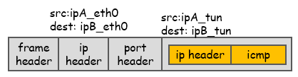

[TOC]

# Linux常用命令


# VSCode SSH 到 CentOS6.10

```shell
# 需要更新glibc和libstdc++
# Update glibc and static libs
wget http://copr-be.cloud.fedoraproject.org/results/mosquito/myrepo-el6/epel-6-x86_64/glibc-2.17-55.fc20/glibc-2.17-55.el6.x86_64.rpm
wget http://copr-be.cloud.fedoraproject.org/results/mosquito/myrepo-el6/epel-6-x86_64/glibc-2.17-55.fc20/glibc-common-2.17-55.el6.x86_64.rpm
wget http://copr-be.cloud.fedoraproject.org/results/mosquito/myrepo-el6/epel-6-x86_64/glibc-2.17-55.fc20/glibc-devel-2.17-55.el6.x86_64.rpm
wget http://copr-be.cloud.fedoraproject.org/results/mosquito/myrepo-el6/epel-6-x86_64/glibc-2.17-55.fc20/glibc-headers-2.17-55.el6.x86_64.rpm
wget https://copr-be.cloud.fedoraproject.org/results/mosquito/myrepo-el6/epel-6-x86_64/glibc-2.17-55.fc20/glibc-utils-2.17-55.el6.x86_64.rpm
wget https://copr-be.cloud.fedoraproject.org/results/mosquito/myrepo-el6/epel-6-x86_64/glibc-2.17-55.fc20/glibc-static-2.17-55.el6.x86_64.rpm
wget https://copr-be.cloud.fedoraproject.org/results/mosquito/myrepo-el6/epel-6-x86_64/glibc-2.17-55.fc20/glibc-debuginfo-2.17-55.el6.x86_64.rpm
wget https://copr-be.cloud.fedoraproject.org/results/mosquito/myrepo-el6/epel-6-x86_64/glibc-2.17-55.fc20/glibc-debuginfo-common-2.17-55.el6.x86_64.rpm
sudo rpm -Uh --force --nodeps \
    glibc-2.17-55.el6.x86_64.rpm \
    glibc-common-2.17-55.el6.x86_64.rpm \
    glibc-devel-2.17-55.el6.x86_64.rpm \
    glibc-headers-2.17-55.el6.x86_64.rpm \
    glibc-static-2.17-55.el6.x86_64.rpm \
    glibc-utils-2.17-55.el6.x86_64.rpm \
    glibc-debuginfo-2.17-55.el6.x86_64.rpm \
    glibc-debuginfo-common-2.17-55.el6.x86_64.rpm

# Update libstdc++
wget https://copr-be.cloud.fedoraproject.org/results/mosquito/myrepo-el6/epel-6-x86_64/gcc-4.8.2-16.3.fc20/libstdc++-4.8.2-16.3.el6.x86_64.rpm
wget  https://copr-be.cloud.fedoraproject.org/results/mosquito/myrepo-el6/epel-6-x86_64/gcc-4.8.2-16.3.fc20/libstdc++-devel-4.8.2-16.3.el6.x86_64.rpm
wget https://copr-be.cloud.fedoraproject.org/results/mosquito/myrepo-el6/epel-6-x86_64/gcc-4.8.2-16.3.fc20/libstdc++-static-4.8.2-16.3.el6.x86_64.rpm
sudo rpm -Uh \
    libstdc++-4.8.2-16.3.el6.x86_64.rpm \
    libstdc++-devel-4.8.2-16.3.el6.x86_64.rpm \
    libstdc++-static-4.8.2-16.3.el6.x86_64.rpm
```


此时g++就不能用了，需要安装对应版本的g++

```shell
# 由于安装g++也需要对应版本的gcc，所以gcc也要升级一下
# 经过尝试，升级gcc版本失败，依赖的较多，还是自己编译高版本吧
wget https://copr-be.cloud.fedoraproject.org/results/mosquito/myrepo-el6/epel-6-x86_64/gcc-4.8.2-16.3.fc20/gcc-4.8.2-16.3.el6.x86_64.rpm
wget https://copr-be.cloud.fedoraproject.org/results/mosquito/myrepo-el6/epel-6-x86_64/gcc-4.8.2-16.3.fc20/gcc-c++-4.8.2-16.3.el6.x86_64.rpm
wget https://copr-be.cloud.fedoraproject.org/results/mosquito/myrepo-el6/epel-6-x86_64/gcc-4.8.2-16.3.fc20/cpp-4.8.2-16.3.el6.x86_64.rpm

sudo rpm -Uh \
    gcc-4.8.2-16.3.el6.x86_64.rpm \
    gcc-c++-4.8.2-16.3.el6.x86_64.rpm \
    cpp-4.8.2-16.3.el6.x86_64.rpm
```


# 驱动开发环境

## Debian安装驱动开发环境

```shell
# 安装开发所需的头文件
apt-get install linux-headers-`uname -r`
```


## Ubuntu安装驱动开发环境

```shell
sudo apt-get install linux-kernel-headers kernel-package
sudo apt-get install build-essential

apt-get install linux-image												// 内核版本
apt-get install linux-source											// 内核源码
apt-get install linux-image-`uname -r`-dbgsym							// 调试符号
```

dbgsym地址：http://ddebs.ubuntu.com/


[（转载）ubuntu 安装 dbgsym (debug-info) - 云+社区 - 腾讯云 (tencent.com)](https://cloud.tencent.com/developer/article/1637887)

1. ubuntu的默认仓库上是没有`dbgsym`的，所以需要添加额外的软件源`/etc/apt/sources.list`：

```shell
deb http://ddebs.ubuntu.com/ <版本代号> main
deb http://ddebs.ubuntu.com/ <版本代号>-updates main
```


2. 添加源公钥key

首次`update`后，可能会报错

```shell
正在读取软件包列表... 完成                                                                                                         
W: GPG 错误：http://ddebs.ubuntu.com precise Release: 由于没有公钥，无法验证下列签名： NO_PUBKEY ECDCAD72428D7C01
W: GPG 错误：http://ddebs.ubuntu.com precise-updates Release: 由于没有公钥，无法验证下列签名： NO_PUBKEY ECDCAD72428D7C01
```

这是因为源公钥没有添加，可使用如下命令从 ubuntu keyserver 添加该源的公钥.

```shell
sudo apt-key adv --keyserver keyserver.ubuntu.com --recv-keys ECDCAD72428D7C01
```


3. 更新源信息

```shell
sudo apt-get update
```


4. 查找和安装dbgsym软件包

更新源后即可像安装普通软件包一样查找和安装 dbgsym，查找时可带上 "-dbgsym" 后缀. 如要查找内核相关 dbgsym，可使用如下命令搜索:

```shell
sudo aptitude search 'linux-image-.*-dbgsym'
```

也可带上版本号直接搜索当前内核的 dbgsym：

```shell
sudo aptitude search 'linux-image-'$(uname -r)'-dbgsym'
```

由于 linux 内核版本也经常迭代更新，可能当前内核版本的 dbgsym 已经在仓库上下线，不能找到和安装对应的 dbgsym， 此时建议系统重装一个存在对应 dbgsym 的内核版本. 如果对最新版本内核没有强需求，建议从 dbgsym 列表中选择一个版本较旧但相对稳定未下线的版本.

```shell
sudo aptitude install linux-{image,headers}-3.13.0-32-generic linux-image-3.13.0-32-generic-dbgsym
```

linux-image 建议 （suggests) 安装 linux-headers，但不是推荐 (recommends)， 使用 aptitude 安装软件包时默认会安装推荐的软件包, 但是对建议的软件包不会管, 建议的软件包通常有很多是不需要的, 如果需要安装可以手动指定。


## CentOS安装驱动开发环境

需要打开`/etc/yum.repos.d/CentOS-Debuginfo.repo`

| 安装包                  | 安装目录                                                     |
| ----------------------- | ------------------------------------------------------------ |
| kernel-devel            | release版驱动开发头文件				\usr\src\kernels\3.10.0-693.el7.x86_64\ |
| kernel-debuginfo        | release版内核调试符号					\usr\lib\debug\lib\modules\3.10.0-693.el7.x86_64\ |
| kernel-debuginfo-common | 内核源码											\usr\src\debug\kernel-3.10.0-693.el7\linux-3.10.0-693.el7.x86_64\ |
| kernel-debug            | debug版内核                                                  |
| kernel-debug-devel      | debug版驱动开发头文件					\usr\src\kernels\3.10.0-693.el7.x86_64.debug\ |
| kernel-debug-debuginfo  | debug版内核调试符号						\usr\lib\debug\lib\modules\3.10.0-693.el7.x86_64.debug\ |

```shell
yum install gcc cmake
```


## 查看内核导出函数

方式1:

```shell
[root@localhost ~]# cat /proc/kallsyms | grep kallsyms_lookup_name
ffffffff811017c0 T module_kallsyms_lookup_name
ffffffff81102330 T kallsyms_lookup_name
ffffffff819a9a40 r __ksymtab_kallsyms_lookup_name
ffffffff819bb580 r __kcrctab_kallsyms_lookup_name
ffffffff819c2d0a r __kstrtab_kallsyms_lookup_name
```


方式2:

> 如果有安装对应的内核源码的话，可以使用方式2

```shell
[root@localhost 3.10.0-693.el7.x86_64]# cat /usr/src/kernels/3.10.0-693.el7.x86_64/System.map | grep kallsyms_lookup_name
ffffffff811017c0 T module_kallsyms_lookup_name
ffffffff81102330 T kallsyms_lookup_name
ffffffff819a9a40 r __ksymtab_kallsyms_lookup_name
ffffffff819bb580 r __kcrctab_kallsyms_lookup_name
ffffffff819c2d0a r __kstrtab_kallsyms_lookup_name
```


方式3:

```shell
[root@localhost 3.10.0-693.el7.x86_64]# cat /boot/System.map-3.10.0-693.el7.x86_64 | grep kallsyms_lookup_name
ffffffff811017c0 T module_kallsyms_lookup_name
ffffffff81102330 T kallsyms_lookup_name
ffffffff819a9a40 r __ksymtab_kallsyms_lookup_name
ffffffff819bb580 r __kcrctab_kallsyms_lookup_name
ffffffff819c2d0a r __kstrtab_kallsyms_lookup_name
```


方式4:

通过`kallsyms_lookup_name`函数去找，但要保证`kallsyms_lookup_name`有被导出


方式5:

> 如果有安装对应版本的debuginfo的话，可以使用方式5

```shell
[root@localhost 3.10.0-693.el7.x86_64]# nm /usr/lib/debug/usr/lib/modules/3.10.0-693.el7.x86_64/vmlinux | grep kallsyms_lookup_name
00000000e007de41 A __crc_kallsyms_lookup_name
ffffffff81102330 T kallsyms_lookup_name
ffffffff819bb580 r __kcrctab_kallsyms_lookup_name
ffffffff819c2d0a r __kstrtab_kallsyms_lookup_name
ffffffff819a9a40 r __ksymtab_kallsyms_lookup_name
ffffffff811017c0 T module_kallsyms_lookup_name
```


# 编译内核所需

## 内核版本号规则

```shell
# Makefile
VERSION = 2
MAJOR REVISION = 6
MINOR REVISION = 18
BUG FIX = 8
EXTRAVERSION = -0.1-default
```

> this is the new versioning system officially adopted since kernel 2.6.11. Looking at the value automatically set in the Makefile, it seems the extraversion must include the bug fix, that is .8-0.1-default.


- Ubuntu:

  ```shell
  apt-get install libncurses5-dev libncursesw5-dev
  apt-get install libssl-dev
  
  # 安装源码文件
  apt-get install linux-source
  ```

- CentOS 编译所需：

	```shell
	yum install ncurses-devel bc
	yum install elfutils-libelf-devel
	```


## CentOS6.10 内核编译

```shell
# 下载源码包
wget https://mirrors.tuna.tsinghua.edu.cn/centos-vault/6.10/os/Source/SPackages/kernel-2.6.32-754.el6.src.rpm

# 安装
rpm -ivh kernel-2.6.32-754.el6.src.rpm
# warning: user mockbuild does not exist - using root
# warning: group mockbuild does not exist - using root

useradd mockbuild

su mockbuild

rpm -ivh kernel-2.6.32-754.el6.src.rpm

cd rpmbuild/SOURCES/

# 解压源码
tar -jvxf linux-2.6.32-754.el6.tar.bz2

cd linux-2.6.32-754.el6

make menuconfig
# Unable to find the ncurses libraries

yum install ncurses-devel

make menuconfig
```


编译选项：

```shell
Kernel hacking--->  
       -*- Magic SysRq key  
       [*] Kernel debugging  
       [*] Compile the kernel with debug info  
       [*] KGDB: kernel debugging with remote gdb --->  
              <*> KGDB: use kgdb over the serial console  
```


**把ext4等文件系统编译进内核，不然不好挂载文件系统。**


修改此目录下的`Makefile`中的`EXTRAVERSION`，如下：

```shell
VERSION = 2
PATCHLEVEL = 6
SUBLEVEL = 32
EXTRAVERSION =-754.el6.x86_64
NAME = Man-Eating Seals of Antiquity
RHEL_MAJOR = 6
RHEL_MINOR = 9
RHEL_RELEASE = 753
RHEL_DRM_VERSION = 4
RHEL_DRM_PATCHLEVEL = 4
RHEL_DRM_SUBLEVEL = 0
```

> 如果不修改此内容的话，内核加载后，会通过内核版本`uname -r`去`/lib/modules/`目录下找相同名的驱动目录，此属性值会影响`uname -r`的显示。


[鸟哥的 Linux 私房菜 -- Linux 核心编译 (vbird.org)](http://cn.linux.vbird.org/linux_basic/0540kernel_3.php)

1. 直接make的话，会把内核和模块全部编译，耗时长
2. 使用`make help`查看支持的编译参数
3. 常见如下：

```shell
[root@www linux-2.6.30.3]# make vmlinux  <==未经压缩的核心
[root@www linux-2.6.30.3]# make modules  <==仅核心模块
[root@www linux-2.6.30.3]# make bzImage  <==经压缩过的核心(默认)
[root@www linux-2.6.30.3]# make all      <==进行上述的三个动作
```


> 我们常见的在 /boot/ 底下的核心文件，都是经过压缩过的核心文件，因此，上述的动作中比较常用的是 modules 与 bzImage 这两个，其中 bzImage 第三个字母是英文大写的 I 喔！bzImage 可以制作出压缩过后的核心， 也就是一般我们拿来进行系统启动的资讯罗！所以，基本上我们会进行的动作是：
>
> ```shell
> [root@www linux-2.6.30.3]# make clean    <==先清除缓存档
> [root@www linux-2.6.30.3]# make bzImage  <==先编译核心
> [root@www linux-2.6.30.3]# make modules  <==再编译模块
> ```


一般调试的时候可以只编译`bzImage`

```shell
make bzImage

# crypto/signature/ksign-publickey.c:2:17: error: key.h: No such file or directory
# crypto/signature/ksign-publickey.c: In function ‘ksign_init’:
# crypto/signature/ksign-publickey.c:10: error: ‘ksign_def_public_key’ undeclared (first use in this function)
# crypto/signature/ksign-publickey.c:10: error: (Each undeclared identifier is reported only once
# crypto/signature/ksign-publickey.c:10: error: for each function it appears in.)
# crypto/signature/ksign-publickey.c:11: error: ‘ksign_def_public_key_size’ undeclared (first use in this function)
# make[2]: *** [crypto/signature/ksign-publickey.o] Error 1
# make[1]: *** [crypto/signature] Error 2
# make: *** [crypto] Error 2

make menuconfig
# Select "Enable loadable module support" Disable "Module signature verification (EXPERIMENTAL)"
# Select "Cryptographic API" Scroll down and Disable "In-kernel signature checker (EXPERIMENTAL)"

make bzImage
```


成功后，生成vmlinux和bzImage

```shell
[root@localhost linux-2.6.32-754.el6]# ll vmlinux
-rwxr-xr-x. 1 root root 135043524 Sep 10 03:57 vmlinux

[root@localhost linux-2.6.32-754.el6]# ll arch/x86/boot/bzImage 
-rw-r--r--. 1 root root 4309072 Sep 10 03:57 arch/x86/boot/bzImage
```


## 驱动/代码集成到内核

例，将一个文件系统代码`testfs`添加到内核

内核源码目录：`/root/rpmbuild/SOURCES/linux-2.6.32-754.el6`

```shell
# 将testfs拷贝到内核fs目录
cp testfs /root/rpmbuild/SOURCES/linux-2.6.32-754.el6/fs -r

cd  /root/rpmbuild/SOURCES/linux-2.6.32-754.el6/fs/testfs
```


给`testfs`添加配置文件`Kconfig`，例如：

```shell
config INFOSEC_FS
        tristate "The Infosecfs filesystem"
        default y
        help
          This is the next generation of the infosecfs filesystem.
```

修改`Makefile`文件如下：

```shell
obj-$(CONFIG_INFOSEC_FS) += infosecfs.o

infosecfs-y     := crypto.o dentry.o file.o inode.o main.o message.o \
                                        mmap.o process_ctrl.o read_write.o sm4.o \
                                        super.o tools.o
```


额外编译选项：

```shell
EXTRA_CFLAGS += -Wno-error
```


```shell
# 切换到fs目录
cd ..

vim Makefile
```

添加内容如下：

```shell
obj-$(CONFIG_INFOSEC_FS)                += testfs/
```


```shell
vim Kconfig
```

添加内容如下：

```shell
source "fs/testfs/Kconfig"
```


## 交叉编译内核

- mips

```shell
apt-get install gcc-mips64el-linux-gnuabi64
export ARCH=mips
export CROSS_COMPILE=mips64el-linux-gnuabi64-
```


- arm

```shell
apt-get install gcc-arm-linux-gnueabi gcc-aarch64-linux-gnu

export ARCH=arm
export CROSS_COMPILE=arm-linux-gnueabi-

export ARCH=arm64
export CROSS_COMPILE= aarch64-linux-gnu-
```


## 编译命令

编译步骤(不能乱)：

```shell
make menuconfig
make
make modules
make modules_install
make install
make headers_install
```

​			

如果遇到不能给驱动下断点(用`hbreak`命令可下断点，但还是不太好调试)的情况，需要修改编译选项：

```shell
CONFIG_DEBUG_SET_MODULE_RONX
CONFIG_DEBUG_RODATA
[CONFIG_RANDOMIZE_BASE] 						// 这个可以用启动参数 nokaslr 替代
```

这两个选项关闭后再编译一次内核


## 卸载多余的内核

```shell
dpkg --get-selections | grep linux
apt-get remove linux-image-xxxx
[apt-get purge linux-image-xxxx]
或
rm /boot/config-xxx /boot/System.map-xxx /boot/initrd.img-xxx /boot/vmlinuz-xxx
sudo update-grub
```


## 创建根文件系统

### CentOS/Fedora

```shell
mkinitrd /boot/initrd.img 2.6.32
```


### Debian/Ubuntu

```shell
mkinitramfs 2.6.32 -o /boot/initramfs.img
```


其中`2.6.32`为`/lib/modules`下的目录名称。


# qemu使用

```shell
apt-get install qemu
```

## CentOS6.10 编译qemu

[CentOS 7下Qemu编译安装 - 华为云 (huaweicloud.com)](https://www.huaweicloud.com/articles/023bb022255569c81600e6e372fa06c0.html)


1. 下载源码并配置

```shell
wget https://download.qemu.org/qemu-6.1.0.tar.xz
tar xvJf qemu-6.1.0.tar.xz
cd qemu-6.1.0
./configure
make
```


2. 安装python3.6

在`./configure`时提示需要`python3.6`

```shell
# 下载源码
wget https://www.python.org/ftp/python/3.6.15/Python-3.6.15.tgz

# 解压
tar -zvxf Python-3.6.15.tgz

# 创建安装目录
mkdir /usr/local/python3

cd Python-3.6.15

# 配置安装目录
./configure  --prefix=/usr/local/python3

# 编译
make

# 安装
make install
```

**验证yum是否受到影响，原因是yum是python写的脚本，如受影响需要修改它使用的python**

使用`yum --help`看看还能不能用

为了不影响其它的软件，就不把python3替换到/usr/bin/python了


3. 编译qemu

```shell
# 由于上面没有替换python，所以需要指定使用的python路径
./configure --python=/usr/local/python3/bin/python3

# ERROR: Cannot find Ninja
# /usr/local/python3/bin/pip3 install ninja
yum install ninja-build

# ERROR: "cc" either does not exist or does not work
# 到这失败
```


1. 降低版本编译

[CentOS 7下Qemu编译安装 - 华为云 (huaweicloud.com)](https://www.huaweicloud.com/articles/023bb022255569c81600e6e372fa06c0.html)

```shell
yum install git

git clone https://gitlab.com/qemu-project/qemu.git

cd qemu

# 选择2.10版本
git checkout stable-2.10

# 说明:
# ./configure -h 查看详细
# -- target-list 设置生成CPU兼容的编译结果,默认兼容所有,编译时间太长
# --audio-drv-list="oss,sdl"  是必须的，否则用生成的 QEMU 创建的虚拟机没有画面。启动虚拟机时只会显示一行: gvncviewer 127.0.0.1::5900 
./configure --target-list="x86_64-softmmu i386-softmmu x86_64-linux-user i386-linux-user" --audio-drv-list="oss,sdl"

# 提示没有SDL库
cd ..
wget http://www.libsdl.org/release/SDL2-2.0.16.tar.gz
tar zvxf SDL2-2.0.16.tar.gz 
cd SDL2-2.0.16
./configure
make
make install

cd ../qemu
# 继续编译qemu
./configure --target-list="x86_64-softmmu i386-softmmu x86_64-linux-user i386-linux-user" --audio-drv-list="oss,sdl"

# glib-2.22 gthread-2.0 is required to compile QEMU
yum install glib2
yum install glib2-devel

# ERROR: pixman >= 0.21.8 not present
yum install pixman-devel

make

make install
```


上面的不能显示

尝试使用v2.11.1版本编译

yum install SDL SDL-devel

编译通过，可以使用


## CentOS rootfs(由于找不到分区，qemu启动此fs失败，使用方式3)

为什么方式1和2都会失败，感觉可能是由于编译内核时，有的驱动是以模块的形式放到initramfs中的，导致rootfs中没有对应的驱动，故不能挂载硬盘，也不能识别分区。


### 方式1:

```shell
dd if=/dev/zero of=CentOSRootfs.img bs=1M seek=2047 count=1

mkfs.ext4 -F CentOSRootfs.img

mkdir -p /mnt/rootfs

mount -o loop CentOSRootfs.img /mnt/rootfs/

wget https://raw.githubusercontent.com/CentOS/sig-cloud-instance-images/CentOS-6.10/docker/centos-6-docker.tar.xz

tar xvf centos-6-docker.tar.xz -C /mnt/rootfs/

minorver=6.10
sudo sed -e "s|^mirrorlist=|#mirrorlist=|g" \
		-e "s|^#baseurl=http://mirror.centos.org/centos/\$releasever|baseurl=https://mirrors.tuna.tsinghua.edu.cn/centos-vault/$minorver|g" \
		-i.bak \
		/mnt/rootfs/etc/yum.repos.d/CentOS-*.repo


chroot /mnt/rootfs/ /bin/bash

yum update -y

# 获取到 kernel
yum install -y yum-utils
rpm -Uvh --nodeps $(repoquery --location kernel-core)

exit

umount /mnt/rootfs
```


### 方式2:

```shell
# 需要 epel 源
yum install debootstrap

1. 安装Ubuntu虚拟机
2. 安装qemu
	apt-get install qemu-system-x86
3. 安装debootstrap
	apt-get install debootstrap
	apt-get install debian-keyring
	apt-get install debian-archive-keyring
4. 下载img构建脚本
	cd $IMAGE/
	wget https://raw.githubusercontent.com/google/syzkaller/master/tools/create-image.sh -O create-image.sh
	chmod +x create-image.sh
	./create-image.sh
	
	4.1 默认生成的是 ubuntu 的 stretch 版本
	4.2 修改 ubuntu 版本
		./create-image.sh --distribution buster
	4.3 默认情况下不是所有的feature都安装，可全部安装
		./create-image.sh --feature full
```


### 方式3(建议使用):

建议在ubuntu系统上使用此方式，创建好的根文件系统再拿到对应的机器上。

```shell
# 创建一个足够大小的安装盘
qemu-img create -f qcow2 centos.qcow2 5G

# 通过安装镜像安装到硬盘
qemu-system-x86_64 -cdrom CentOS-6.10-x86_64-minimal.iso -drive file=centos.qcow2,format=qcow2 -2

# 安装完成后，进入系统查看/etc/fstab根目录挂载的设备，如/dev/sda，并从/boot/grub/grub.cfg中拿到启动参数
# 并将/boot/initramfs拿出来
qemu-system-x86_64 -drive file=centos.qcow2,format=qcow2 -m 2G -smp 2

# 使用自编译内核启动
qemu-system-x86_64 -kernel centos6.10/bzImage -hda centos6.10/centos.qcow2 -append "root=/dev/mapper/vg_test-lv_root LANG=en_US.UTF-8 crashkernel=auto  KEYBOARDTYPE=pc KEYTABLE=us rhgb quiet" -m 2G -initrd /root/initramfs-2.6.32-754.el6.x86_64.img
```

相关链接：

[linux - How to use custom image kernel for ubuntu in qemu? - Stack Overflow](https://stackoverflow.com/questions/65951475/how-to-use-custom-image-kernel-for-ubuntu-in-qemu)


## qemu编译

```shell
# 下载源码
wget https://download.qemu.org/qemu-5.2.0.tar.xz

# 解压源码
tar Jvxf qemu-5.2.0.tar.xz

# 安装依赖
apt install python3-pip
pip3 install ninja
apt-get install pkg-config libglib2.0-dev libpixman-1-dev

# 编译
cd qemu-5.2.0
./configure
make
make install
```

## qemu 安装debian mips虚拟机

[qemu 安装debian mips虚拟机 - 简书 (jianshu.com)](https://www.jianshu.com/p/c9dd8e708550)

[Building a Debian Stretch QEMU image for MIPSel - Blah Cats](https://blahcat.github.io/2017/07/14/building-a-debian-stretch-qemu-image-for-mipsel/)

### 1.下载必备程序

```shell
# 发行版安装程序
wget http://ftp.debian.org/debian/dists/stretch/main/installer-mipsel/current/images/malta/netboot/initrd.gz

# 内核
wget http://ftp.debian.org/debian/dists/stretch/main/installer-mipsel/current/images/malta/netboot/vmlinux-4.9.0-13-4kc-malta
```

### 2.创建硬盘

```shell
# 硬盘驱动器
qemu-img create -f qcow2 disk.qcow2 15G
```

### 3.开始安装

```shell
# 运行qemu安装mips debian
$ qemu-system-mipsel -M malta -m 1G \
  -hda ./disk.qcow2 \
  -initrd ./initrd.gz \
  -kernel ./vmlinux-4.9.0-13-4kc-malta -append "nokaslr" \
  -nographic
```


## qemu 安装debian mips 龙芯虚拟机(未成功)

需要编译最新的6.0版本

```shell
wget https://download.qemu.org/qemu-6.0.0-rc1.tar.xz
tar xvJf qemu-6.0.0-rc1.tar.xz
cd qemu-6.0.0-rc1
./configure
make
```


### 1.下载必备程序

```shell
# 发行版安装程序
wget http://ftp.debian.org/debian/dists/stretch/main/installer-mips64el/current/images/loongson-3/netboot/initrd.gz

# 内核
wget http://ftp.debian.org/debian/dists/stretch/main/installer-mips64el/current/images/loongson-3/netboot/vmlinux-4.9.0-13-loongson-3
```

### 2.创建硬盘

```shell
# 硬盘驱动器
qemu-img create -f qcow2 disk.qcow2 15G
```

### 3.查看CPU支持列表

```shell
# 显示支持的machine 类型
qemu-system-mips64el -machine help
```

### 4.开始安装

```shell
# 运行qemu安装mips debian 启动不起来
qemu-system-mips64el -M loongson3-virt -cpu Loongson-3A1000 -m 2G \
-hda ./disk.qcow2 \
-initrd ./initrd.gz \
-kernel ./vmlinux-4.9.0-13-loongson-3 -append "nokaslr" \
-nographic
```


```shell
# 启动不起来
qemu-system-mips64el -M loongson3-virt \
-device qemu-xhci,id=xhci -device usb-tablet,bus=xhci.0 \
-kernel ./vmlinux-4.9.0-13-loongson-3 \
-initrd ./initrd.gz \
-append "console=ttyS0,115200" \
-drive file=./disk.qcow2,if=virtio \
-nographic
```


```shell
# 启动不起来
qemu-system-mips64el -M malta -m 2G \
-hda ./disk.qcow2 \
-initrd ./initrd.gz \
-kernel ./vmlinux-4.9.0-13-5kc-malta -append "nokaslr" \
-nographic
```


```shell
$ qemu-system-mips64el -M malta -cpu MIPS64R2-generic -m 2G \
  -hda ./disk.qcow2 \
  -initrd ./initrd.gz \
  -kernel ./vmlinux-4.9.0-13-5kc-malta -append "nokaslr" \
  -nographic
```


## vnc

由于CentOS6.10上编译的qemu总是提示不支持SDL，故使用vnc显示

```shell
# 绑定本机ip : 5900 + prot
-vnc :5
```


## 调试

```shell
# gdbserver 在 1234 端口
-s

# 等待gdb连接
-S
```


```shell
# qemu-start.sh

#!/bin/sh
qemu-system-x86_64 \
       -kernel /home/superman/Desktop/kernelsrc/kernel-2.6.32-754.src/arch/x86/boot/bzImage \
       -hda centos.qcow2 \
       -append "root=/dev/mapper/vg_test-lv_root nokaslr" \
       -m 2G \
       -initrd initramfs-2.6.32-754.el6.x86_64.img \
       -s \
       -S
```


## 网络配置

### 安装软件

```shell
apt-get install bridge-utils        # 虚拟网桥工具
apt-get install uml-utilities       # UML（User-mode linux）工具
```


### 创建网桥

```shell
ifconfig <你的网卡名称(能上网的那张)> down    # 首先关闭宿主机网卡接口
brctl addbr br0                     # 添加一座名为 br0 的网桥
brctl addif br0 <你的网卡名称>        # 在 br0 中添加一个接口
brctl stp br0 off                   # 如果只有一个网桥，则关闭生成树协议
brctl setfd br0 1                   # 设置 br0 的转发延迟
brctl sethello br0 1                # 设置 br0 的 hello 时间
ifconfig br0 0.0.0.0 promisc up     # 启用 br0 接口
ifconfig <你的网卡名称> 0.0.0.0 promisc up    # 启用网卡接口
dhclient br0                        # 从 dhcp 服务器获得 br0 的 IP 地址
brctl show br0                      # 查看虚拟网桥列表
brctl showstp br0                   # 查看 br0 的各接口信息
```

当配置完成之后执行 ifconfig 结果应该如下：


此时网桥已经得到了 IP，并且能够连接网络的网卡 enp0s5 也加入了网桥，此时我们的网桥状态大致是这种情况


桥的一端连接到 enp0s5，我们只需要再把另一端接到 QEMU 虚拟机(准确的说是 VLAN )上面就可以了！


### 创建tap设备

创建一个TAP设备，作为QEMU一端的接口

```shell
tunctl -t tap0 -u root              # 创建一个 tap0 接口，只允许 root 用户访问
brctl addif br0 tap0                # 在虚拟网桥中增加一个 tap0 接口
ifconfig tap0 0.0.0.0 promisc up    # 启用 tap0 接口
brctl showstp br0                   # 显示 br0 的各个接口
```

此时网桥的信息应该是：


这样就相当于把两张网卡通过网桥连起来了：


### 启动qemu

```shell
sudo qemu-system-mipsel -M malta -kernel vmlinux-3.2.0-4-4kc-malta -hda debian_squeeze_mipsel_standard.qcow2 -append "root=/dev/sda1 console=tty0" -nographic -net nic -net tap,ifname=tap0,script=no,downscript=no
```

特别说明一下参数含义：-net nic 表示希望 QEMU 在虚拟机中创建一张虚拟网卡，-net tap 表示连接类型为 TAP，并且指定了网卡接口名称(就是刚才创建的 tap0，相当于把虚拟机接入网桥)。

script 和 downscript 两个选项的作用是告诉 QEMU 在启动系统的时候是否调用脚本自动配置网络环境，如果这两个选项为空，那么 QEMU 启动和退出时会自动选择第一个不存在的 tap 接口(通常是 tap0)为参数，调用脚本 /etc/qemu-ifup 和 /etc/qemu-ifdown。由于我们已经配置完毕，所以这两个参数设置为 no 即可。


# 编译

## 安装编译工具链

1. Ubuntu

```shell
apt install build-essential
apt install cmake
```


2. CentOS

```shell
yum install gcc gcc-c++ cmake
```


## CMake 开发环境

### 重命名

```cmake
# 修改字首
set_target_properties(new_thing PROPERTIES PREFIX "")

# 修改输出名称
set_target_properties(new_thing PROPERTIES OUTPUT_NAME "better_name")

# 修改后缀
set_target_properties(new_thing PROPERTIES SUFFIX ".so.1")
```


### 生成compile_commands.json

这个文件一般是vim的clangd(LSP)插件使用。

```cmake
set(CMAKE_EXPORT_COMPILE_COMMANDS 1)
```


#### linux内核生成compile_commands.json

高版本内核代码中scripts/clang-tools/gen_compile_commands.py，低版本内核下载这个并执行

[scripts: add a tool to produce a compile_commands.json file · torvalds/linux@b302046 (github.com)](https://github.com/torvalds/linux/commit/b30204640192)


### 指定生成目录

```cmake
# 设置输出目录
set(EXECUTABLE_OUTPUT_PATH ${PROJECT_SOURCE_DIR}/bin)
message(${EXECUTABLE_OUTPUT_PATH})

set(LIBRARY_OUTPUT_PATH ${PROJECT_SOURCE_DIR}/bin/lib)
message(${LIBRARY_OUTPUT_PATH})
```


### 添加宏定义

```cmake
ADD_DEFINITIONS(-DMACRO)
```


### 编译库

```cmake
cmake_minimum_required(VERSION 3.10)

project(plugin1)

include_directories(../../include)

add_library(plugin1 [SHARED | STATIC]  plugin1.cpp)
```


### 添加链接库

```cmake
target_link_libraries(${PROJECT_NAME} -ldl </lib/test.so> </lib/static.a>)
```


### 判断编译平台

方式1:

```cmake
MESSAGE(STATUS "operation system is ${CMAKE_SYSTEM}")
 
IF (CMAKE_SYSTEM_NAME MATCHES "Linux")
	MESSAGE(STATUS "current platform: Linux ")
ELSEIF (CMAKE_SYSTEM_NAME MATCHES "Windows")
	MESSAGE(STATUS "current platform: Windows")
ELSEIF (CMAKE_SYSTEM_NAME MATCHES "FreeBSD")
	MESSAGE(STATUS "current platform: FreeBSD")
ELSE ()
	MESSAGE(STATUS "other platform: ${CMAKE_SYSTEM_NAME}")
ENDIF (CMAKE_SYSTEM_NAME MATCHES "Linux")
 
MESSAGE(STSTUS "###################################")
```

方式2:

```cmake
IF (WIN32)
	MESSAGE(STATUS "Now is windows")
ELSEIF (APPLE)
	MESSAGE(STATUS "Now is Apple systens.")
ELSEIF (UNIX)
	MESSAGE(STATUS "Now is UNIX-like OS's.")
ENDIF ()
```


## Makefile


### Makefile编写


### make指定Makefile

```shell
# make 默认会找当前目录下的Makefile，也可通过 -f 参数指定文件
make -f <Makefile>
```


## 交叉编译openssl

1. 下载openssl源码
2. 安装交叉编译工具链
3. 配置好交叉编译链的环境变量：`export PATH=$PATH:/usr/local/arm-build/bin`
4. 修改环境变量`CC`：`export CC=arm-linux-gnueabihf-gcc`
5. `.config`
6. 手动修改生成的Makefile，找到有`-m64`的地方删除
7. make & make install


## bear工具

目前失败，发现好像依赖bash-compiletion，bear安装上报语法参数错误。

例在`CentOS6.10`上安装

```shell
# 下载
wget https://github.com/rizsotto/Bear/archive/refs/tags/2.4.4.tar.gz

# 解压
tar -zvxf 2.4.4.tar.gz

cd Bear-2.4.4/

mkdir build
cd build/
cmake ../
make
make install
```

显示如下，即安装完成：

```shell
[root@localhost build]# make install
[100%] Built target ear
Install the project...
-- Install configuration: "Release"
-- Installing: /usr/local/share/doc/bear/COPYING
-- Installing: /usr/local/share/doc/bear/README.md
-- Installing: /usr/local/share/doc/bear/ChangeLog.md
-- Installing: /usr/local/lib64/bear/libear.so
-- Installing: /usr/local/bin/bear
-- Installing: /usr/local/share/man/man1/bear.1
-- Installing: /usr/local/share/bash-completion/completions/bear
```


# 调试


## gdb

详细见：[awesome-cheatsheets/gdb.txt at master · supermanc88/awesome-cheatsheets (github.com)](https://github.com/supermanc88/awesome-cheatsheets/blob/master/tools/gdb.txt)

### 常用命令

```shell
```


### 设置源码目录

正常情况下，二进制文件会根据调试编译的调试信息去找源码路径，但如果源码路径移动了，就需要以下代码调整

```shell
# set substitute-path 现路径 原路径
set substitute-path /root/rpmbuild/SOURCES/linux-2.6.32-754.el6/ /home/superman/Desktop/kernelsrc/kernel-2.6.32-754.src
```


### vscode 中 使用 gdb

```shell
# launch.json

{
    // 使用 IntelliSense 了解相关属性。 
    // 悬停以查看现有属性的描述。
    // 欲了解更多信息，请访问: https://go.microsoft.com/fwlink/?linkid=830387
    "version": "0.2.0",
    "configurations": [
        {
            "name": "(gdb) 启动",
            "type": "cppdbg",
            "request": "launch",
            "program": "${workspaceFolder}/vmlinux",
            "args": [],
            "stopAtEntry": false,
            "cwd": "${workspaceFolder}",
            "environment": [],
            "externalConsole": false,
            "MIMode": "gdb",
            "miDebuggerServerAddress": "127.0.0.1:1234",
            "sourceFileMap": {
                "/root/rpmbuild/SOURCES/linux-2.6.32-754.el6/" : "/home/superman/Desktop/kernelsrc/kernel-2.6.32-754.src"
            },
            "setupCommands": [
                {
                    "description": "为 gdb 启用整齐打印",
                    "text": "-enable-pretty-printing",
                    "ignoreFailures": true
                }
            ]
        }
    ]
}
```


## vscode

### gdb

见gdb章节。


## 内核调试

### 双机调试

- 在启动参数后加入[`/boot/grub/grub.cfg`]：

  - 被调试机：
    `kgdboc=ttyS0,115200 nokaslr kgdbwait`
    虚拟机设置
    串口：`//./pipe/com_1`
    该端是客户端
    另一端是虚拟机

  - 主机：
    `kgdboc=ttyS0,115200`
    虚拟机设置
    串口：`//./pipe/com_1`
    该端是服务端
    另一端是虚拟机

    驱动调试
    `dmesg`		查看驱动打印
    其实日志是写到这个文件：`/var/log/message`

- 驱动操作命令：

```shell
insmod / modprobe						加载驱动
rmmod									卸载驱动
lsmod									查看系统中所有已经被加载了的所有的模块以及模块间的依赖关系
modinfo									获得模块的信息
```


#### 设置被调试机

环境：CentOS7

```shell
vim /boot/grub2/grub.cfg 
```


> kgdboc=ttyS0,115200	设置串口
>
> nokaslr	禁用基址随机化
>
> kgdbwait	开启直接等待


> 添加串行端口，使用命名管道：
>
> //./pipe/com_1
>
> 该端是客户端
>
> 另一端是虚拟机


#### 设置主机

```shell
vim /boot/grub2/grub.cfg 
```


> 添加串行端口，使用命名管道：
>
> //./pipe/com_1
>
> 该端是服务端
>
> 另一端是虚拟机


### qemu调试

#### qemu文件系统

见qemu使用章节。

#### qemu脚本

```shell
#!/bin/sh
qemu-system-x86_64 \
       -kernel /home/superman/Desktop/kernelsrc/kernel-2.6.32-754.src/arch/x86/boot/bzImage \
       -hda centos.qcow2 \
       -append "root=/dev/mapper/vg_test-lv_root nokaslr" \
       -m 2G \
       -initrd initramfs-2.6.32-754.el6.x86_64.img \
       -s \
       -S
```


### 打印调试信息

```shell
# 会一直打印，需要Ctrl－C手动终止
cat /proc/kmsg 

# N为一数字，表示显示最后N行
dmesg 或 dmesg | tail -N 

# 清空dmesg缓存
# 会打印原来的数据
dmesg -c
# 不打印直接清空
dmesg -C
```


### 模块调试：

#### 安装卸载

```shell
# 安装
insmod module_name.ko

# 卸载
rmmod module_name
```


#### 查看模块信息

```shell
modinfo module_name
# 如下：
root@superman-PC:~/linuxkbd# modinfo LinuxKbd.ko
filename:       /root/linuxkbd/LinuxKbd.ko
license:        GPL
version:        v1.0.1
srcversion:     56D00E9624437478DB00C95
depends:        
retpoline:      Y
name:           LinuxKbd
vermagic:       5.4.50-amd64-desktop SMP mod_unload 
```


#### 获取模块基址

```shell
# 方式1
cat /proc/modules | grep module_name

# 方式2
cat /sys/module/module_name/section/.text
```

#### 加载符号

```shell
add-symbol-file /path/module_name.ko module_base_address
```

1. 被调试机：
   	echo g > /proc/sysrq-trigger

> 中断不生效，这是因为sysrq在系统未开启：
> echo 1 > /proc/sys/kernel/sysrq

> 单步时间过长会导致被调试机卡死，使用以下命令禁用时长
> echo 0 > /proc/sys/kernel/hung_task_timeout_secs

2. 主机使用gdb vmlinux 后命令：

```shell
add-symbol-file /home/superman/Desktop/drivers/linuxkdb/LinuxKbd.ko 0xffffffffc0114000

# 进入等待状态，直到连接被调试机
target remote /dev/ttyS0

#后续调试见gdb命令
```

> Warning:
> Cannot insert breakpoint 1.
> Error accessing memory address 0xfa4581ae: Unknown error 4294967295
> hbreak [breakpoints]
> 详见：[https://www.linuxquestions.org/questions/programming-9/kgdb-module-debugging-question-906503/]

#### 驱动build目录

```shell
/lib/modules/$(shell uname -r)/build
```

#### 安装的带符号的vmlinux路径

```shell
/lib/debug/lib/modules/$(shell uname -r)/
```


### crash

```shell
/var/crash/

# Ubuntu安装：
apt install linux-crashdump

# CentOS安装：
yum install crash

# 配置：
kdump-config show
```


# 软件安装/卸载

## dpkg

### 是否安装

```shell
# 列出安装的软件包
dpkg -l

dpkg -l | grep gcc
```

### *.deb安装

```shell
dpkg -i *.deb
```


## yum

```shell
# 清空软件源缓存
yum clean all

# 更新软件源
yum makecache
```


```shell
# 显示已安装的软件包
yum list installed

# 查找可安装的软件包
yum search xxx

# 安装软件包
yum install java-1.8.0-openjdk-devel

# 卸载软件
yum remove xxx
```


## rpm

### 安装

```shell
rpm -iv xxx.rpm

# 查看软件包信息
rpm -qi <packagename>

# 升级
rpm -Uh xxx.rpm
```


查看软件安装时间

```shell
[root@localhost ~]# rpm -qi xorg-x11-utils | grep "Install Date"
Name        : xorg-x11-utils               Relocations: (not relocatable)
Version     : 7.5                               Vendor: CentOS
Release     : 14.el6                        Build Date: Thu 12 May 2016 12:02:48 PM PDT
Install Date: Mon 06 Sep 2021 09:32:46 AM PDT      Build Host: worker1.bsys.centos.org
Group       : User Interface/X              Source RPM: xorg-x11-utils-7.5-14.el6.src.rpm
Size        : 234796                           License: MIT
Signature   : RSA/SHA1, Thu 12 May 2016 12:21:43 PM PDT, Key ID 0946fca2c105b9de
Packager    : CentOS BuildSystem <http://bugs.centos.org>
URL         : http://www.x.org
Summary     : X.Org X11 X client utilities
Description :
A collection of client utilities which can be used to query the X server
for various information.
```


### 卸载

```shell
# 查询到包名再卸载
rpm -qa | grep epel
# epel-release-7-13.noarch
rpm -e epel-release-7-13.noarch

# 卸载时不卸载依赖
rpm -e --nodeps <packagename>
```


### 是否安装

```shell
rpm -qa | grep nginx
```


### 安装位置

```shell
# 查看程序隶属的包
rpm -qf /usr/sbin/nginx

# 通过包名查看包中的所有文件及路径
rpm -ql nginx-1.12.1-1.el7.ngx.x86_64
```


## apt

```shell
apt list --installed																		列出安装的软件包
apt remove [python3-apt 包名]
```


## pacman

```shell
# 更新软件源
pacman -Sy

# 查找包
pacman -Ss <packagename>

# 查找已安装的包
pacman -Qs <packagename>

# 安装
pacman -S <packagename>

# 删除包，保留其全部已经安装的依赖关系
pacman -R <packagename>

# 删除包，删除其所有没有被其他已安装软件使用的依赖关系
pacman -Rs <packagename>

# 删除包，删除其所有依赖这个包的程序
pacman -Rsc <packagename>
```


## 通用查找软件路径

### 查看安装路径

```shell
whereis nginx
# /usr/sbin/nginx ---执行路径
# /usr/lib64/nginx ---安装路径
# /etc/nginx/ --- 配置路径
# /usr/share/nginx ---默认站点目录
```


### 查看执行路径

```shell
which nginx
# /usr/sbin/nginx
```


# 图形界面

## xfce4

```shell
$sudo apt-get install xfce4

# 启动
startx
```

```shell
# 以下命令未测试

# 可用以命令显示当前系统安装的窗口管理器：
$sudo update-alternatives --display x-window-manager

# 用以下命令设置默认的启动项目：
$sudo update-alternatives --config x-window-manager
```


## gnome

```shell
# 以下命令测试未成功，暂时用不上

# 然后我们安装图形界面, 执行这句的时候目测会报错，不过别慌：
apt-get install gnome

apt-get update

apt-get install x-window-system-core gnome-core
```


## 切换到命令行

按下 `Ctrl + ALT + Fn`进入`tty`

按下fn就进入第n工作组

第一到第六工作组为命令行模式，进入后输入用户名+回车，密码加回车

第七工作组为X window 即GUI工作组


# 系统

## 修改root密码

在启动时修改kernel启动参数，在后面添加`single`或数字`1`，会直接进入系统，之后使用命令`passwd root`

## 关闭ASLR 基址随机

方式1:

```shell
echo 0 > /proc/sys/kernel/randomize_va_space
```


方式2:

在`/boot/grub/grub.conf`的启动参数后加`nokaslr`


## 定时任务

`crond`命令每分钟会定期检查是否有要执行的工作，如果有要执行的工作便会自动执行该工作。

注意：新创建的`cron`任务，不会马上执行，至少要过2分钟后才可以，当然可以重启cron来马上执行。

```shell
crontab [-u user] file
```

或

```shell
crontab [-u user] {-l | -r | -e}
```


**说明：**

crontab 是用来让使用者在固定时间或固定间隔执行程序之用，换句话说，也就是类似使用者的时程表。

-u user 是指设定指定 user 的时程表，这个前提是你必须要有其权限(比如说是 root)才能够指定他人的时程表。如果不使用 -u user 的话，就是表示设定自己的时程表。

**参数说明**：

- -e : 执行文字编辑器来设定时程表，内定的文字编辑器是 VI，如果你想用别的文字编辑器，则请先设定 VISUAL 环境变数来指定使用那个文字编辑器(比如说 setenv VISUAL joe)
- -r : 删除目前的时程表
- -l : 列出目前的时程表


时间格式如下：

```
f1 f2 f3 f4 f5 program
```

- 其中 f1 是表示分钟，f2 表示小时，f3 表示一个月份中的第几日，f4 表示月份，f5 表示一个星期中的第几天。program 表示要执行的程序。
- 当 f1 为 * 时表示每分钟都要执行 program，f2 为 * 时表示每小时都要执行程序，其馀类推
- 当 f1 为 a-b 时表示从第 a 分钟到第 b 分钟这段时间内要执行，f2 为 a-b 时表示从第 a 到第 b 小时都要执行，其馀类推
- 当 f1 为 */n 时表示每 n 分钟个时间间隔执行一次，f2 为 */n 表示每 n 小时个时间间隔执行一次，其馀类推
- 当 f1 为 a, b, c,... 时表示第 a, b, c,... 分钟要执行，f2 为 a, b, c,... 时表示第 a, b, c...个小时要执行，其馀类推

```
*    *    *    *    *
-    -    -    -    -
|    |    |    |    |
|    |    |    |    +----- 星期中星期几 (0 - 6) (星期天 为0)
|    |    |    +---------- 月份 (1 - 12) 
|    |    +--------------- 一个月中的第几天 (1 - 31)
|    +-------------------- 小时 (0 - 23)
+------------------------- 分钟 (0 - 59)
```

使用者也可以将所有的设定先存放在文件中，用 crontab file 的方式来设定执行时间。


## 虚拟机工具

```shell
apt-get install open-vm-tools open-vm-tools-desktop
```


## 内核版本

```shell
uname -r 														// 内核版本
uname -a 														// 内核及系统版本
```


## 平台

```shell
# cpu架构
root@kyv10:~# uname -m
x86_64

# 系统位数
[root@localhost ~]# uname -i
x86_64

# 通过long的长度获取倍数
[root@localhost ~]# getconf LONG_BIT
64
```


## 系统信息

```shell
# redhat 系查看版本
cat /etc/redhat-release 										

# centos 系
cat /etc/centos-release

# Ubuntu系
root@superman-PC:~# lsb_release -a
No LSB modules are available.
Distributor ID: Uos
Description:    UnionTech OS Desktop 20 Home
Release:        20 Home
Codename:       n/a

# 银河麒麟
cat /etc/os-release


root@superman-PC:~# cat /proc/version
Linux version 5.4.50-amd64-desktop (deepin@deepin-PC) (gcc version 8.3.0 (Uos 8.3.0.3-3+rebuild)) #3000 SMP Fri Dec 18 18:10:42 CST 2020

# 查看cpu相关信息
cat /proc/cpuinfo
```


## screenfetch

```shell
# 以arch为例
pacman -S screenfetch
```

如图所示：


## swap 交换分区 虚拟内存

```shell
dd if=/dev/zero of=/data/swap bs=512 count=8388616		//将zero设备作为输出，写入swap，count写入多少次，这里一共写入4G，如果没有swap会自动创建
mkswap /data/swap	//设置swap为交换区
swapon /data/swap		//启用
echo "/data/swap swap swap defaults    0  0" >> /etc/fstab	//开机引导时会自动启动
```

查看是否生效:

```shell
free -m		//可以看到swap分区
```

关闭：

```shell
swapoff /data/swap
swapoff -a >/dev/null
rm -rf /data/swap
```


## 查看glibc版本

```shell
root@kyv10:~# strings /lib/x86_64-linux-gnu/libc.so.6 | grep GLIBC
GLIBC_2.2.5
GLIBC_2.2.6
...
GLIBC_2.23
GLIBC_PRIVATE

root@kyv10:~# strings /usr/lib/gcc/x86_64-linux-gnu/5/libstdc++.so | grep GLIBCXX
GLIBCXX_3.4
GLIBCXX_3.4.1
...
GLIBCXX_3.4.21
GLIBCXX_DEBUG_MESSAGE_LENGTH
```

怎样查看`libc.so`和`libstdc++.so`库的位置：

```shell
# 可以找到库所在位置
gcc -v
g++ -v
```


**CentOS 5.6位置**

```shell
[root@localhost ~]# strings /lib64/libc.so.6 | grep GLIBC
GLIBC_2.2.5
GLIBC_2.2.6
GLIBC_2.3
GLIBC_2.3.2
GLIBC_2.3.3
GLIBC_2.3.4
GLIBC_2.4
GLIBC_2.5
GLIBC_PRIVATE
```


## 自启动

### 查看有哪些开机自启服务

1. CentOS6

```shell
[root@kernel-dev yum.repos.d]# chkconfig --list
auditd          0:off   1:off   2:on    3:on    4:on    5:on    6:off
blk-availability        0:off   1:on    2:on    3:on    4:on    5:on    6:off
crond           0:off   1:off   2:on    3:on    4:on    5:on    6:off
ip6tables       0:off   1:off   2:on    3:on    4:on    5:on    6:off
iptables        0:off   1:off   2:on    3:on    4:on    5:on    6:off
kdump           0:off   1:off   2:off   3:on    4:on    5:on    6:off
lvm2-monitor    0:off   1:on    2:on    3:on    4:on    5:on    6:off
mdmonitor       0:off   1:off   2:on    3:on    4:on    5:on    6:off
netconsole      0:off   1:off   2:off   3:off   4:off   5:off   6:off
netfs           0:off   1:off   2:off   3:on    4:on    5:on    6:off
network         0:off   1:off   2:on    3:on    4:on    5:on    6:off
nfs-rdma        0:off   1:off   2:off   3:off   4:off   5:off   6:off
postfix         0:off   1:off   2:on    3:on    4:on    5:on    6:off
rdisc           0:off   1:off   2:off   3:off   4:off   5:off   6:off
rdma            0:off   1:on    2:on    3:on    4:on    5:on    6:off
restorecond     0:off   1:off   2:off   3:off   4:off   5:off   6:off
rsyslog         0:off   1:off   2:on    3:on    4:on    5:on    6:off
saslauthd       0:off   1:off   2:off   3:off   4:off   5:off   6:off
sshd            0:off   1:off   2:on    3:on    4:on    5:on    6:off
udev-post       0:off   1:on    2:on    3:on    4:on    5:on    6:off
```


### 服务自启

https://www.jianshu.com/p/c999eefbc197

https://www.huaweicloud.com/articles/d57fcb08c079cace334188a8aad2b8e9.html

### 脚本自启

以`/mnt/shell/autostart.sh`为例：

```shell
#!/bin/bash
#description:开机自启脚本
#启动nginx
```

- 方法1

  1. 赋予脚本可执行权限（/mnt/shell/autostart.sh是你的脚本路径）

  ```shell
  chmod +x /mnt/shell/autostart.sh 
  ```

  2. 打开/etc/rc.d/rc/local文件，在末尾增加如下内容

  ```shell
  /mnt/shell/autostart.sh
  ```

  3. 在centos7中，/etc/rc.d/rc.local的权限被降低了，所以需要执行如下命令赋予其可执行权限

  ```shell
  chmod +x /etc/rc.d/rc.local
  ```

- 方法2

  1. 将脚本移动到/etc/rc.d/init.d目录下

  ```shell
  mv  /mnt/shell/autostart.sh /etc/rc.d/init.d
  ```

  2. 增加脚本的可执行权限

  ```shell
  chmod +x  /etc/rc.d/init.d/autostart.sh
  ```

  3. 添加脚本到开机自动启动项目中

  ```shell
  cd /etc/rc.d/init.d
  chkconfig --add autostart.sh
  chkconfig autostart.sh on
  ```


## 驱动自启

例：

1. 将驱动`ko`文件拷贝到 目录：`/lib/modules/5.4.50-amd64-desktop/kernel/drivers/input/keyboard`
2. 执行命令 "`depmod -a`" 更新索引
3. 编辑文件 `/etc/modules-load.d/modules.conf` 添加 驱动名(**不加后缀**，如`LinuxKbd`),**如没有modules.conf文件，自己创建任意名称文件也可**


## 程序的多版本管理

以`gcc`和`g++`为例：

step1.安装多版本

```shell
sudo apt-get install gcc-5 gcc-5-multilib
sudo apt-get install g++-5 g++-5-multilib
sudo apt-get install gcc-6 gcc-6-multilib
sudo apt-get install g++-6 g++-6-multilib
sudo apt-get install gcc-7 gcc-7-multilib
sudo apt-get install g++-7 g++-7-multilib
sudo update-alternatives --install /usr/bin/gcc gcc /usr/bin/gcc-5 50
sudo update-alternatives --install /usr/bin/gcc gcc /usr/bin/gcc-6 60
sudo update-alternatives --install /usr/bin/gcc gcc /usr/bin/gcc-7 70
sudo update-alternatives --install /usr/bin/g++ g++ /usr/bin/g++-5 50
sudo update-alternatives --install /usr/bin/g++ g++ /usr/bin/g++-6 60
sudo update-alternatives --install /usr/bin/g++ g++ /usr/bin/g++-7 70
```

step2.然后选择gcc和g++版本

```shell
sudo update-alternatives --config gcc
sudo update-alternatives --config g++
```


## 更新源

常用软件源地址：

清华源： https://mirrors.tuna.tsinghua.edu.cn/

中科大源： http://mirrors.ustc.edu.cn/


CentOS系的可以再加上epel源

```shell
yum -y install epel-release
```


### CentOS5.6

```shell
# CentOS-Base.repo
#
# The mirror system uses the connecting IP address of the client and the
# update status of each mirror to pick mirrors that are updated to and
# geographically close to the client.  You should use this for CentOS updates
# unless you are manually picking other mirrors.
#
# If the mirrorlist= does not work for you, as a fall back you can try the 
# remarked out baseurl= line instead.
#
#

[base]
name=CentOS-$releasever - Base
#mirrorlist=http://mirrorlist.centos.org/?release=$releasever&arch=$basearch&repo=os
baseurl=https://mirrors.tuna.tsinghua.edu.cn/centos-vault/5.6/os/$basearch/
gpgcheck=1
gpgkey=file:///etc/pki/rpm-gpg/RPM-GPG-KEY-CentOS-5

#released updates 
[updates]
name=CentOS-$releasever - Updates
#mirrorlist=http://mirrorlist.centos.org/?release=$releasever&arch=$basearch&repo=updates
baseurl=https://mirrors.tuna.tsinghua.edu.cn/centos-vault/5.6/updates/$basearch/
gpgcheck=1
gpgkey=file:///etc/pki/rpm-gpg/RPM-GPG-KEY-CentOS-5

#additional packages that may be useful
[extras]
name=CentOS-$releasever - Extras
#mirrorlist=http://mirrorlist.centos.org/?release=$releasever&arch=$basearch&repo=extras
baseurl=https://mirrors.tuna.tsinghua.edu.cn/centos-vault/5.6/extras/$basearch/
gpgcheck=1
gpgkey=file:///etc/pki/rpm-gpg/RPM-GPG-KEY-CentOS-5

#additional packages that extend functionality of existing packages
[centosplus]
name=CentOS-$releasever - Plus
#mirrorlist=http://mirrorlist.centos.org/?release=$releasever&arch=$basearch&repo=centosplus
baseurl=https://mirrors.tuna.tsinghua.edu.cn/centos-vault/5.6/centosplus/$basearch/
gpgcheck=1
enabled=0
gpgkey=file:///etc/pki/rpm-gpg/RPM-GPG-KEY-CentOS-5

#contrib - packages by Centos Users
[contrib]
name=CentOS-$releasever - Contrib
#mirrorlist=http://mirrorlist.centos.org/?release=$releasever&arch=$basearch&repo=contrib
baseurl=https://mirrors.tuna.tsinghua.edu.cn/centos-vault/5.6/contrib/$basearch/
gpgcheck=1
enabled=0
gpgkey=file:///etc/pki/rpm-gpg/RPM-GPG-KEY-CentOS-5
```


### CentOS6.10

该文件夹提供较早版本的 CentOS，例如 CentOS 6；同时提供当前 CentOS 大版本的历史小版本的归档； 还提供 CentOS 各个版本的源代码和调试符号。

建议先备份 `/etc/yum.repos.d/` 内的文件。

需要确定您所需要的小版本，如无特殊需要则使用该大版本的最后一个小版本，比如 6.10，5.11，我们将其标记为 `$minorver`，需要您在之后的命令中替换。

然后编辑 `/etc/yum.repos.d/` 中的相应文件，在 `mirrorlist=` 开头行前面加 `#` 注释掉；并将 `baseurl=` 开头行取消注释（如果被注释的话），把该行内的域名及路径（例如`mirror.centos.org/centos/$releasever`）替换为 `mirrors.tuna.tsinghua.edu.cn/centos-vault/$minorver`。

以上步骤可以被下方的命令完成

```shell
minorver=6.10
sudo sed -e "s|^mirrorlist=|#mirrorlist=|g" \
         -e "s|^#baseurl=http://mirror.centos.org/centos/\$releasever|baseurl=https://mirrors.tuna.tsinghua.edu.cn/centos-vault/$minorver|g" \
         -i.bak \
         /etc/yum.repos.d/CentOS-*.repo
```

注意其中的`*`通配符，如果只需要替换一些文件中的源，请自行增删。

注意，如果需要启用其中一些 repo，需要将其中的 `enabled=0` 改为 `enabled=1`。

最后，更新软件包缓存

```shell
sudo yum makecache
```


### CentOS7/8

该文件夹只提供 CentOS 7 与 8，架构仅为 `x86_64` ，如果需要较早版本的 CentOS，请参考 centos-vault 的帮助，若需要其他架构，请参考 centos-altarch 的帮助。

建议先备份 `/etc/yum.repos.d/` 内的文件（CentOS 7 及之前为 `CentOS-Base.repo`，CentOS 8 为`CentOS-Linux-*.repo`）

然后编辑 `/etc/yum.repos.d/` 中的相应文件，在 `mirrorlist=` 开头行前面加 `#` 注释掉；并将 `baseurl=` 开头行取消注释（如果被注释的话），把该行内的域名（例如`mirror.centos.org`）替换为 `mirrors.tuna.tsinghua.edu.cn`。

以上步骤可以被下方的命令一步完成

```shell
sudo sed -e 's|^mirrorlist=|#mirrorlist=|g' \
         -e 's|^#baseurl=http://mirror.centos.org|baseurl=https://mirrors.tuna.tsinghua.edu.cn|g' \
         -i.bak \
         /etc/yum.repos.d/CentOS-*.repo
```

注意其中的`*`通配符，如果只需要替换一些文件中的源，请自行增删。

注意，如果需要启用其中一些 repo，需要将其中的 `enabled=0` 改为 `enabled=1`。

最后，更新软件包缓存

```shell
sudo yum makecache
```


## 安全

### pam


# 权限


## 文件权限(见文件 -- 文件权限章节)


## uid

下面分别用RUID, EUID,SUID来表示实际用户ID，有效用户ID，设置用户ID。另外用户ID是个整型数，为了说明方便真接使用了用户名来代表不同的UID。先解释一下这几个ID的作用：

- RUID, 用于在系统中标识一个用户是谁，当用户使用用户名和密码成功登录后一个UNIX系统后就唯一确定了他的RUID.
- EUID, 用于系统决定用户对系统资源的访问权限，通常情况下等于RUID。
- SUID，用于对外权限的开放。跟RUID及EUID是用一个用户绑定不同，它是跟文件而不是跟用户绑定。

说明SUID的时候很多书都简略的提了一下passwd这个程序，下面就拿这个例子来分析。我们知道linux系统的密码都存在了/etc/shadow这个文件里。这个文件是如此的重要，在做任何修改之前最好先备份一下。查看/etc/shadow文件的属性如下：

```shell
[root@localhost ~]# ll /etc/shadow

-r——– 1 root root 1144 Jul 20 22:33 /etc/shadow
```

从上可以看出/etc/shadow文件是一个属于root用户及root组的文件，并且只有EUID为root的用户具有读的权限，其它所有EUID都没有任何权限。当你在steve用户（EUID此时也为steve）的shell下试图用vim打开这个文件时会提示权限不允许。至于连root用户也只有读的权限我猜是为了不鼓励root用户使用vim类的编辑器去直接修改它，而要采用passwd命令来修改这个文件。如果你非要直接修改它，那么你可以使用chmod命令修改为属性为root可写，然后就可以修改了。

用过UNIX系统的人都知道，任何一个用户都可以使用passwd这个命令来得新设定自己的密码。但从上面已经知道，非root用记是无法读这个文件的，那么普通用户是如何做到修改这个文件的呢？我们知道passwd这个命令实际执行的程序是/usr/bin/passwd, 查看这个文件属性如下：

```shell
-r-s–x–x 1 root root 21944 Feb 12  2006 /usr/bin/passwd；
```

对应文件存取标志的s位就是通常说的SUID位，另外可以看到所有用户都有执行的这个程序权力。当steve用户执行passwd命令的时候。Shell会fork出一个子进程，此时进程的EUID还是steve，然后exec程序/usr/bin/passwd。exec会根据/usr/bin/passwd的SUID位会把进程的EUID设成root,  此时这个进程都获得了root权限, 得到了读写/etc/shadow文件的权限, 从而steve用户可完成密码的修改。 exec退出后会恢复steve用户的EUID为steve.这样就不会使steve用户一直拥有root权限。


个人理解：uid是实际用户id，每个文件都会有一个uid； 用户在登录的过程中，使用的是uid。用户在执行文件时，pID对应的uid就是用户的uid；  euid是用户的有效id，在执行文件的时候，由于权限的问题，某个进程的uid需要‘变为’其他用户才可以执行，这时‘变身’后的用户id及就是euid。 在没有‘变身’的情况下，euid=uid. suid标示一个文件可以被另一个文件使用‘变身’的策略使用它的权限 ，比如上面的/etc/passwd 文件，其他用户只有执行的权限，但是没有读取得权限，其他非root用户在执行的时候，由于文件设置了suid，则执行过程中euid可以被更改为root,这样就可以访问了 。


## chmod

用来修改文件的`mode bits`，权限

修改时可以使用符号，也可以使用8进制数

```shell
chmod [OPTION]... MODE[,MODE]... FILE...
chmod [OPTION]... OCTAL-MODE FILE...
chmod [OPTION]... --reference=RFILE FILE...
```


更通俗易懂的语法形式：

```shell
chmod [who] [+ | - | =] [mode] 文件名
```


命令中各选项的含义为：

操作对象who可是下述字母中的任一个或者它们的组合：

- `u` 表示“用户（user）”，即文件或目录的所有者。
- `g` 表示“同组（group）用户”，即与文件属主有相同组ID的所有用户。
- `o` 表示“其他（others）用户”。
- `a` 表示“所有（all）用户”。它是系统默认值。


操作符号可以是：

- `+`添加某个权限。
- `-` 取消某个权限。
- `=` 赋予给定权限并取消其他所有权限（如果有的话）。


设置 mode 所表示的权限可用下述字母的任意组合：

- `r` 可读。
- `w` 可写。
- `x` 可执行。
- `X` 只有目标文件对某些用户是可执行的或该目标文件是目录时才追加x 属性。
- `s` 在文件执行时把进程的属主或组ID置为该文件的文件属主。方式“u＋s”设置文件的用户ID位，“g＋s”设置组ID位。
- `t` 保存程序的文本到交换设备上。
- `u` 与文件属主拥有一样的权限。
- `g` 与和文件属主同组的用户拥有一样的权限。
- `o` 与其他用户拥有一样的权限。


> `s`:set user or group ID on execution
>
> UNIX访问权限标志setuid和setGID（“设置用户ID”和“SET组ID”）。允许用户分别使用可执行文件所有者或组的文件系统权限运行可执行文件，并在目录中更改行为 。 它们通常用于允许计算机系统上的用户运行具有临时提升权限的程序，以便执行特定任务。
>
> [setuid - Wikipedia](https://en.wikipedia.org/wiki/Setuid)


文件名：以空格分开的要改变权限的文件列表，支持通配符。　


在一个命令行中可给出多个权限方式，其间用逗号隔开。例如：

chmod g+r，o+r example  % 使同组和其他用户对文件example 有读权限。


## adduser 添加用户

#### adduser

> 在使用adduser命令时,它会添加这个用户名,并创建和用户名名称相同的组名,并把这个用户名添加到自己的组里去,并在/home目录想创建和用户名同名的目录,并拷贝/etc/skel目录下的内容到/home/用户名/的目录下,并提示输入密码,并提示填写相关这个用户名的信息。
>
> 用adduser这个命令创建的账号是普通账号,可以用来登陆系统.


```shell
adduser testuser

# 删除创建用户
# -r参数删除用户testuser的同时，将其宿主目录和系统内与其相关的内容删除。
userdel -r testuser
```


### useradd

> 命令说明: 在使用命令useradd时，它会添加这个用户名，并创建和用户名相同的组名，但它并不在/home目录下创建基于用户名的目录,也不提示创建新的密码。也就是说使用useradd mongo 创建出来的用户,将是默认的"三无"用户,无家目录,无密码,无系统shell,换句话说,它创建的是系统用户,无法用它来登陆系统.

```shell
root@silkPC:/home# useradd mongotest
```

### 如何用useradd创建的用户登陆系统呢?

1. 首先为新用户设置密码

```shell
root@silkPC:/home# passwd mongotest

Enter new UNIX password: 

Retype new UNIX password: 

passwd: password updated successfully
```

2. 为新用户创建家目录/home/mongotest

```shell
root@silkPC:/home# mkdir mongotest
```

3. 更改家目录归属

```shell
root@silkPC:/home# chown -R mongotest:mongotest /home/mongotest/

root@silkPC:/home# ll

total 16

drwxr-xr-x  4 root      root      4096  6月 28 15:51 ./

drwxr-xr-x 24 root      root      4096  6月 28 10:16 ../

drwxr-xr-x 46 denson    denson    4096  6月 28 15:18 denson/

drwxr-xr-x  2 mongotest mongotest 4096  6月 28 15:51 mongotest/
```

4. 修改mongotest的登陆Shell为/bin/bash

```shell
root@silkPC:/home# usermod -s /bin/bash mongotest

root@silkPC:/home# tail -1 /etc/passwd  //查看命令

mongotest:x:1001:1001::/home/mongotest:/bin/bash
```

5. 进入home目录,再将/etc/skel目录下的文件复制到该用户目录下,就大功告成了.

```shell
root@silkPC:/home# cp -r /etc/skel /mongotest
```

上述方法,是用useradd mongotest 没有指定任何参数的情况下的修改.如果在用useradd创建用户时加上参数,例如:"-d"--指定家目录,"-s"--指定shell,即可以让该用户正常登陆系统.

例如:

```shell
root@silkPC:/home# useradd -d /home/mongotest -m -s /bin/bash mongotest
```

删除用户

```shell
root@silkPC:/home# userdel mongotest  //-r参数表示删除家目录
```

#### 参数说明:

-c 备注 加上备注。并会将此备注文字加在/etc/passwd中的第5项字段中;

-d 用户主文件夹。指定用户登录所进入的目录，并赋予用户对该目录的的完全控制权，一般与 "-m" 一起使用,让用户自定义家目录路径;

-e 有效期限。指定帐号的有效期限。格式为YYYY-MM-DD，将存储在/etc/shadow;

-f 缓冲天数。限定密码过期后多少天，将该用户帐号停用;

-g 主要组。设置用户所属的主要组;

-G 次要组。设置用户所属的次要组，可设置多组;

-M 强制不创建用户主文件夹;

-m 强制建立用户主文件夹，并将/etc/skel/当中的文件复制到用户的根目录下;

-p 密码。输入该帐号的密码;

-s shell。用户登录所使用的shell;

-u uid。指定帐号的标志符user id，简称uid;


## userdel 删除用户

```shell
# 删除用户user2
userdel user2

# 删除用户user3，同时删除他的工作目录
userdel -r user3
```


## 用户组

### groupadd 创建用户组

```shell
# 创建一个users组，其gid为888
groupadd -g 888 users
```


### gpasswd 为组添加用户

**只有root和组管理员能够改变组成员**

```shell
# 把user1加入到users组
gpasswd -a user1 users

# 把user1退出users组
gpasswd -d user1 users
```


### groupmod 修改组

```shell
# 修改组名users为usersgroup
groupmod -n users usersgroup
```


### groupdel 删除组

```shell
# 删除组users
groupdel users
```


### chown

Linux chown（英文全拼：**change owner**）命令用于设置文件所有者和文件关联组的命令。

Linux/Unix 是多人多工操作系统，所有的文件皆有拥有者。利用 chown 将指定文件的拥有者改为指定的用户或组，用户可以是用户名或者用户 ID，组可以是组名或者组 ID，文件是以空格分开的要改变权限的文件列表，支持通配符。 。

chown 需要超级用户 **root** 的权限才能执行此命令。

**使用权限** : root

```shell
chown [-cfhvR] [--help] [--version] user[:group] file...
```

**参数** :

- user : 新的文件拥有者的使用者 ID
- group : 新的文件拥有者的使用者组(group)
- -c : 显示更改的部分的信息
- -f : 忽略错误信息
- -h :修复符号链接
- -v : 显示详细的处理信息
- -R : 处理指定目录以及其子目录下的所有文件
- --help : 显示辅助说明
- --version : 显示版本

#### 实例

把 /var/run/httpd.pid 的所有者设置 root：

```shell
chown root /var/run/httpd.pid
```

将文件 file1.txt 的拥有者设为 runoob，群体的使用者 runoobgroup :

```shell
chown runoob:runoobgroup file1.txt
```

将当前前目录下的所有文件与子目录的拥有者皆设为 runoob，群体的使用者 runoobgroup:

```shell
chown -R runoob:runoobgroup *
```

把 /home/runoob 的关联组设置为 512 （关联组ID），不改变所有者：

```shell
chown :512 /home/runoob
```


# 解压缩

## *.rpm

```shell
# 在debian系中解压rpm
apt install rpm2cpio
rpm2cpio xxx.rpm | cpio -div
```


## *.zip
```shell
# 压缩：
# -q 不显示指令执行过程
# -r 递归处理，将指定目录下的所有文件和子目录一并处理。
zip -q -r xxx.zip ./*

# 解压 -d 解压到指定目录：
unzip -d ./tempdir xxx.zip
```

## *.tar.gz
```shell
#压缩：
tar -zcvf xxx.tar.gz ./*

#解压 -C 指定解压目录：
tar -C /usr/local -zxvf xxx.tar.gz		
```

## *.tar.bz2
```shell
# 解压：
tar -jxvf ×××.tar.bz2
```

## *.tar.xz
```shell
#解压：
tar xvJf ×××.tar.xz
```

## *.tgz
```shell
#解压：
tar -zxvf xxx.tgz
```

# 文件

## mount

```shell
man mount

NAME
       mount - mount a filesystem

SYNOPSIS
       mount [-h|-V]

       mount [-l] [-t fstype]

       mount -a [-fFnrsvw] [-t fstype] [-O optlist]

       mount [-fnrsvw] [-o options] device|mountpoint

       mount [-fnrsvw] [-t fstype] [-o options] device mountpoint

       mount --bind|--rbind|--move olddir newdir

       mount      --make-{shared|slave|private|unbindable|rshared|rslave|rpri‐
       vate|runbindable} mountpoint
```

参数：

- -t :指定文件系统类型，通常不必指定。mount会自动选择正确的类型
- -o remount :将一个已经挂载的文件系统用不同的方式重新挂载
- -o ro :用只读模式挂载
- -o rw :用可读写模式挂载
- -o loop :使用loop模式用来将一个img当成硬盘挂载在系统上

例：

```shell
mount -t ext4 /dev/sda /

mount -o ro /dev/hda1 /mnt

mount -o loop /tmp/image.iso /mnt/cdrom
```


卸载：

```shell
umount /mnt/cdrom
```


### 重新挂载

```shell
mount -o rw,remount /
```


### 文件系统变只读

1. 首先可以尝试以`rw`模式重新挂载
2. 如果失败的话，可以尝试使用`fsck`命令对设备进行修复

例：

```shell
# root @ OpenWrt in ~ [14:40:52] C:16
$ fsck.ext4 /dev/mmcblk0p2 
e2fsck 1.45.6 (20-Mar-2020)
rootfs contains a file system with errors, check forced.
Pass 1: Checking inodes, blocks, and sizes
Inode 7, i_size is 264302592, should be 268521472.  Fix<y>? yes
Pass 2: Checking directory structure

Pass 3: Checking directory connectivity
Pass 4: Checking reference counts
Pass 5: Checking group summary information
Block bitmap differences:  -1837056 +(1838593--1838594)
Fix<y>? yes
Free blocks count wrong for group #4 (9776, counted=9775).
Fix<y>? yes
Free blocks count wrong for group #56 (32260, counted=32259).
Fix<y>? yes
Free blocks count wrong (3321770, counted=3331543).
Fix<y>? yes
Inode bitmap differences:  +17934
Fix<y>? yes
Free inodes count wrong for group #2 (2, counted=1).
Fix<y>? yes
Free inodes count wrong (821366, counted=821365).
Fix<y>? yes

rootfs: ***** FILE SYSTEM WAS MODIFIED *****
rootfs: ***** REBOOT SYSTEM *****
rootfs: 23435/844800 files (0.0% non-contiguous), 252457/3584000 blocks
```


### -t参数解读

mount和umount支持文件系统子类型。子类型由“.subtype”后缀定义。例如'fuse.sshfs'。

```c
execl("/bin/mount", "mount", "-i", "--no-canonicalize", "-t", "ecryptfs", fullpath_source, fullpath_target, "-o", opts, NULL);
```


> **-i, --internal-only**
>
> Don't call the /sbin/mount.<filesystem> helper even if it exists.


## fsck 检查与修复Linux文件系统的命令

```shell
fsck from util-linux 2.36
Usage: fsck.ext4 [-panyrcdfktvDFV] [-b superblock] [-B blocksize]
                [-l|-L bad_blocks_file] [-C fd] [-j external_journal]
                [-E extended-options] [-z undo_file] device

Emergency help:
 -p                   Automatic repair (no questions)
 -n                   Make no changes to the filesystem
 -y                   Assume "yes" to all questions
 -c                   Check for bad blocks and add them to the badblock list
 -f                   Force checking even if filesystem is marked clean
 -v                   Be verbose
 -b superblock        Use alternative superblock
 -B blocksize         Force blocksize when looking for superblock
 -j external_journal  Set location of the external journal
 -l bad_blocks_file   Add to badblocks list
 -L bad_blocks_file   Set badblocks list
 -z undo_file         Create an undo file
```


一般情况下就只使用以下命令进行修复

```shell
fsck /
```


## tree命令

```shell
# 安装
yum install tree
apt install tree
pacman -Sy tree
```


```shell
# 列出当前目录结构
tree
```

常用参数：

- -a 显示所有文件和目录
- -d 显示目录名称而非内容
- -L level 限制目录显示层级。

例：

```shell
[root@VM-4-16-centos www.xxx.com]# tree -L 1
.
|-- CHANGELOG.md
|-- composer.json
|-- composer.lock
|-- config.php
|-- extend.php
|-- flarum
|-- LICENSE
|-- public
|-- README.md
|-- site.php
|-- storage
`-- vendor

3 directories, 9 files
```


## sshfs

```shell
# 在开发机上安装sshfs包
yum install sshfs

# 挂载
sshfs root@192.168.1.1:/root/test/ test

# 卸载
fusermount -u test
```


## Linux共享文件夹

```shell
# 安装
yum install samba

# 查看状态
[root@fstest infosecfs]# service smb status
smbd is stopped

# 配置文件目录
/etc/samba/smb.conf 

# 假如Linux下想共享的目录为：/home/chm/Desktop/infosecfs

sudo gedit /etc/samba/smb.conf 编辑smb.conf 文件

在配置文件末尾添加

[ShareFiles]
comment = Shared Folder require password
path = /home/magic/share
public = yes

writable = yes
valid users = magic
create mask = 0777
directory mask = 0777
force user = nobody
force group = nogroup
available = yes
browseable = yes


保存后重新启动samba，sudo /etc/init.d/samba restart
```


## 远程拷贝 scp 命令

```shell
# 从远程拷贝到本地
# 有文件夹需要 -r 参数
scp -r root@192.168.231.163:/root/go/src/github.com/DWBC-ConPeer/crypto-gm/* ./

# 从本地拷贝到远程
scp -r ./* root@192.168.231.163:/root/go/src/github.com/DWBC-ConPeer/crypto-gm/
```


## 查看文件内容

```shell
tail -f -n 100 <文件名>
```


## 查看文件的inode number

```shell
ls -li
```

输出如下：

```shell
root@kerneldev:~/testalg/sm4# ls -li
total 88
2100384 -rw------- 1 root root   287 10月 27 16:08 Makefile
2100394 -rw-r--r-- 1 root root    33 10月 27 16:08 modules.order
2100397 -rw-r--r-- 1 root root     0 10月 27 16:08 Module.symvers
2100386 -rw------- 1 root root  7702 10月 27 16:08 sm4_generic.c
2100399 -rw-r--r-- 1 root root 27064 10月 27 16:08 sm4_generic.ko
2100390 -rw-r--r-- 1 root root    33 10月 27 16:08 sm4_generic.mod
2100396 -rw-r--r-- 1 root root   819 10月 27 16:08 sm4_generic.mod.c
2100400 -rw-r--r-- 1 root root  3200 10月 27 16:08 sm4_generic.mod.o
2100391 -rw-r--r-- 1 root root 24800 10月 27 16:08 sm4_generic.o
2100385 -rw------- 1 root root   284 10月 27 16:08 sm4.h
```


## 查找文件/内容

**查找指定文件**

```shell
find <指定目录> <指定条件> <指定动作>
	- <指定目录>： 所要搜索的目录及其所有子目录。默认为当前目录。
　- <指定条件>： 所要搜索的文件的特征。
　- <指定动作>： 对搜索结果进行特定的处理。
find /usr/include -name "ioctl.h" -ls
```

**查找包含指定内容的文件**

```shell
grep -r "被查找的字符串" /dir
```

## 链接

- 软链接

```shell
ln -s TARGET_PATH LINK_NAME
```

- 硬链接

```shell
```


## 磁盘占用

```shell
df -h
Filesystem      Size  Used Avail Use% Mounted on
tmpfs           793M  1.9M  792M   1% /run
/dev/sda3       118G   14G   98G  13% /
tmpfs           3.9G     0  3.9G   0% /dev/shm
tmpfs           5.0M  4.0K  5.0M   1% /run/lock
tmpfs           4.0M     0  4.0M   0% /sys/fs/cgroup
/dev/sda2       512M  7.9M  505M   2% /boot/efi
tmpfs           793M  120K  793M   1% /run/user/1000
tmpfs           793M   72K  793M   1% /run/user/0
```

- 查看inode使用量

  ```shell
  df -i
  ```

- 目录占用大小

  ```shell
  du -d 1 -h
  	-d 表示深度
  
  # 快速查看文件夹大小
  du -d 0 -h ./
  ```


## 查看分区文件系统类型

```shell
df -T
$ df -T
Filesystem           Type       1K-blocks      Used Available Use% Mounted on
/dev/root            ext4          967576    796380    154812  84% /
tmpfs                tmpfs         470280     18664    451616   4% /tmp
/dev/mmcblk0p1       vfat           65390     18054     47336  28% /boot
tmpfs                tmpfs            512         0       512   0% /dev
/dev/root            ext4          967576    796380    154812  84% /opt/docker
```


## /etc/mtab和/etc/fstab

### /etc/fstab

> /etc/fstab是开机自动挂载的配置文件，在开机时起作用。相当于启动Linux的时候，自动使用检查分区的fsck命令和挂载分区的mount命令，检查分区和挂载分区都是根据/etc/fstab中记录的相关信息进行的。


### /etc/mtab

> /etc/mtab是当前的分区挂载情况，记录的是当前系统已挂载的分区。每次挂载/卸载分区时会更新/etc/mtab文件中的信息(执行mount命令会改变/etc/mtab的信息)


```shell
# 此命令也可看到挂载的文件系统
cat /proc/mounts
```


## rsync 文件同步

### 安装

```shell
# Debian
$ sudo apt-get install rsync

# Red Hat
$ sudo yum install rsync

# Arch Linux
$ sudo pacman -S rsync
```

**注意，传输的双方都必须安装 rsync。**

例：

```shell
rsync -av /root/rpmbuild/SOURCES/linux-2.6.32-754.el6/ root@192.168.231.176:/root/rpmbuild/SOURCES/linux-2.6.32-754.el6/

rsync -av root@192.168.231.176:/root/rpmbuild/SOURCES/linux-2.6.32-754.el6/ /root/rpmbuild/SOURCES/linux-2.6.32-754.el6/
```


## dd生成文件

```shell
dd if=/dev/zero of=test.txt bs=1 count=4096
```


## lsof

```shell
yum install lsof
```


## 文件权限

```shell
[root@www /]# ls -l
total 64
dr-xr-xr-x   2 root root 4096 Dec 14  2012 bin
dr-xr-xr-x   4 root root 4096 Apr 19  2012 boot
……
```


每个文件的属性由左边第一部分的 10 个字符来确定（如下图）。


从左至右用 **0-9** 这些数字来表示。

文件类型：

- 当为 **d** 则是目录
- 当为 **-** 则是文件；
- 若是 **l** 则表示为链接文档(link file)；
- 若是 **b** 则表示为装置文件里面的可供储存的接口设备(可随机存取装置)；
- 若是 **c** 则表示为装置文件里面的串行端口设备，例如键盘、鼠标(一次性读取装置)。


# 进程

## 查看系统中所有的进程

```shell
ps aux
```


|USER|PID|%CPU|%MEM|VSZ|RSS|TTY|STAT|START|TIME|COMMAND|
|----|---|----|----|---|---|---|----|-----|----|-------|
|由哪个用户产生	|进程ID		|进程占用CPU资源|进程占用内存资源 |占用虚拟内存大小(KB)| 占用实际物理内存(KB)| 在哪个终端运行|	进程状态 |	进程启动时间		|占用CPU运行时间|		产生进程的命令|
|USER        		|PID 			|			%CPU 				|		%MEM  				|	  VSZ  						|	 RSS 								|TTY      			|		STAT 		|START   					|	TIME 					|	COMMAND         |
|root        		|  1 			|			 0.0 				|		 0.0  				|	19232  						|	1508 								|?        			|		Ss   		|06:32   					|	0:01 					|	/sbin/init      |
|root        		|  2 			|			 0.0 				|		 0.0  				|	    0  						|	   0 								|?        			|		S    		|06:32   					|	0:00 					|	[kthreadd]      |

- a：显示一个终端的所有进程，除会话引线外；
- u：显示进程的归属用户及内存的使用情况；
- x：显示没有控制终端的进程；
- -l：长格式显示更加详细的信息；
- -e：显示所有进程；

## 查看系统所有的进程，而且可以看到父进程和进程优先级

```shell
ps -le
```


## 查看当前shell产生的进程

```shell
ps -l
```


## 定时任务

crontab

我们经常使用的是`crontab`命令是`cron table`的简写，它是`cron`的配置文件，也可以叫它作业列表，我们可以在以下文件夹内找到相关配置文件。

- `/var/spool/cron/` 目录下存放的是每个用户包括root的crontab任务，每个任务以创建者的名字命名
- `/etc/crontab` 这个文件负责调度各种管理和维护任务。
- `/etc/cron.d/` 这个目录用来存放任何要执行的crontab文件或脚本。
- 我们还可以把脚本放在`/etc/cron.hourly`、/etc/cron.daily、`/etc/cron.weekly`、`/etc/cron.monthly`目录中，让它每小时/天/星期、月执行一次。


```shell
crontab [-u username]　　　　//省略用户表表示操作当前用户的crontab
    -e      (编辑工作表)
    -l      (列出工作表里的命令)
    -r      (删除工作作)
```

crontab的命令构成为 时间+动作，其时间有**分、时、日、月、周**五种，操作符有

- ***** 取值范围内的所有数字
- **/** 每过多少个数字
- **-** 从X到Z
- **，**散列数字

### 实例

**实例1：每1分钟执行一次myCommand**

```shell
* * * * * myCommand
```

**实例2：每小时的第3和第15分钟执行**

```shell
3,15 * * * * myCommand
```

**实例3：在上午8点到11点的第3和第15分钟执行**

```shell
3,15 8-11 * * * myCommand
```

**实例4：每隔两天的上午8点到11点的第3和第15分钟执行**

```shell
3,15 8-11 */2  *  * myCommand
```

**实例5：每周一上午8点到11点的第3和第15分钟执行**

```shell
3,15 8-11 * * 1 myCommand
```

**实例6：每晚的21:30重启smb**

```shell
30 21 * * * /etc/init.d/smb restart
```

**实例7：每月1、10、22日的4 : 45重启smb**

```shell
45 4 1,10,22 * * /etc/init.d/smb restart
```

**实例8：每周六、周日的1 : 10重启smb**

```shell
10 1 * * 6,0 /etc/init.d/smb restart
```

**实例9：每天18 : 00至23 : 00之间每隔30分钟重启smb**

```shell
0,30 18-23 * * * /etc/init.d/smb restart
```

**实例10：每星期六的晚上11 : 00 pm重启smb**

```shell
0 23 * * 6 /etc/init.d/smb restart
```

**实例11：每一小时重启smb**

```shell
0 */1 * * * /etc/init.d/smb restart
```

**实例12：晚上11点到早上7点之间，每隔一小时重启smb**

```shell
0 23-7/1 * * * /etc/init.d/smb restart
```


# 网络

## ifconfig

```shell
ifconfig [-a] [-v] [-s] <interface> [[<AF>] <address>]
[add <address>[/<prefixlen>]]		# 设置interface的地址
[del <address>[/<prefixlen>]]		# 删除interface的地址
[[-]broadcast [<address>]]  [[-]pointopoint [<address>]] 	# 设置广播地址
[netmask <address>]  [dstaddr <address>]  [tunnel <address>] # 设置interface的子网掩码 
[outfill <NN>] [keepalive <NN>]
[hw <HW> <address>]  [mtu <NN>]
[[-]trailers]  [[-]arp]  [[-]allmulti]
[multicast]  [[-]promisc]
[mem_start <NN>]  [io_addr <NN>]  [irq <NN>]  [media <type>]
[txqueuelen <NN>]
[name <newname>]		# 修改interfac的名称
[[-]dynamic]
[up|down] ...		# 启动或关闭指定的interface
```

- promisc 启用或禁用混杂模式，如果开启，interface将接收网络上的所有数据包
- tunnel 建立一个IPv4与IPv6的隧道

## Bridge

同 tap/tun、veth-pair 一样，Bridge 也是一种**虚拟网络设备**，所以具备虚拟网络设备的所有特性，比如可以配置 IP、MAC 等。

除此之外，Bridge 还是一个交换机，**具有交换机所有的功能。**

对于普通的网络设备，就像一个管道，只有两端，数据从一端进，从另一端出。而 **Bridge 有多个端口，数据可以从多个端口进，从多个端口出。**

Bridge 的这个特性让它可以接入其他的网络设备，比如物理设备、虚拟设备、VLAN 设备等。Bridge 通常充当主设备，其他设备为从设备，这样的效果就等同于物理交换机的端口连接了一根网线。比如下面这幅图通过 Bridge 连接两个 VM 的 tap 虚拟网卡和物理网卡 eth0。


### VM 同主机通信

以这个图来简单说明下，借助 Bridge 来完成同主机两台 VM 的之间的通信流程。

首先准备一个 centos 或 ubuntu 虚拟机，然后创建一个 bridge：

```shell
ip link add br0 type bridge
ip link set br0 up
```

然后通过 `virt-manager` 创建两个 kvm 虚拟机：kvm1 和 kvm2（前提得支持嵌套虚拟化），将它们的 vNIC 挂到 br0 上，如下图：


kvm 虚机会使用 tap 设备作为它的虚拟网卡，我们验证下：

```shell
# ps -ef | grep kvm1
libvirt+      3549     1  87 ?        00:22:09 qemu-system-x86_64 -enable-kvm -name kvm1 ... -netdev tap,fd=26,id=hostnet0,vhost=on,vhostfd=28 ...
```

可以看到，其中网络部分参数，`-netdev tap,fd=26` 表示的就是连接主机上的 tap 设备。

创建的 fd=26 为读写 `/dev/net/tun` 的文件描述符。

使用 `lsof -p 3549` 验证下：

```shell
# lsof -p 3549
COMMAND    PID USER   FD      TYPE             DEVICE    SIZE/OFF     NODE NAME
...
qemu-system 3549  libvirt-qemu   26u      CHR             10,200         0t107    135 /dev/net/tun
...
```

可以看到，PID 为 3549 的进程打开了文件 `/dev/net/tun`，分配的文件描述符 fd 为 26。

因此，我们可以得出以下结论：在 kvm 虚机启动时，会向内核注册 tap 虚拟网卡，同时打开设备文件 `/dev/net/tun`，拿到文件描述符 fd，然后将 fd 和 tap 关联，tap 就成了一端连接着用户空间的 qemu-kvm，一端连着主机上的 bridge 的端口，促使两者完成通信。

### Bridge 常用使用场景

Bridge 设备通常就是结合 tap/tun、veth-pair 设备用于虚拟机、容器网络里面。这两种网络，在数据传输流程上还有些许不同，我们简单来看下：

首先是虚拟机网络，虚拟机一般通过 tap/tun 设备将虚拟机网卡同宿主机里的 Bridge 连接起来，完成同主机和跨主机的通信。如下图所示：


虚拟机发出的数据包通过 tap 设备先到达 br0，然后经过 eth0 发送到物理网络中，数据包不需要经过主机的的协议栈，效率是比较高的。

其次是容器网络（容器网络有多种引申的形式，这里我们只说 Bridge 网络），容器网络和虚拟机网络类似，不过一般是使用 veth-pair 来连接容器和主机，因为在主机看来，容器就是一个个被隔离的 namespace，用 veth-pair 更有优势。如下图所示：


容器的 Bridge 网络通常配置成内网形式，要出外网需要走 NAT，所以它的数据传输不像虚拟机的桥接形式可以直接跨过协议栈，而是必须经过协议栈，通过 NAT 和 ip_forward 功能从物理网卡转发出去，因此，从性能上看，Bridge 网络虚拟机要优于容器。


### 创建网桥

```shell
apt-get install bridge-utils        # 虚拟网桥工具
apt-get install uml-utilities       # UML（User-mode linux）工具

ifconfig <你的网卡名称(能上网的那张)> down    # 首先关闭宿主机网卡接口
brctl addbr br0                     # 添加一座名为 br0 的网桥
brctl addif br0 <你的网卡名称>        # 在 br0 中添加一个接口
brctl stp br0 off                   # 如果只有一个网桥，则关闭生成树协议
brctl setfd br0 1                   # 设置 br0 的转发延迟
brctl sethello br0 1                # 设置 br0 的 hello 时间
ifconfig br0 0.0.0.0 promisc up     # 启用 br0 接口
ifconfig <你的网卡名称> 0.0.0.0 promisc up    # 启用网卡接口
dhclient br0                        # 从 dhcp 服务器获得 br0 的 IP 地址
brctl show br0                      # 查看虚拟网桥列表
brctl showstp br0                   # 查看 br0 的各接口信息
```


### 删除网桥

```shell
# 删除网桥上的设备
brctl delif br0 tap0
brctl delif br0 ens33

# 删除网桥
brctl delbr br0
```


## 虚拟网卡设备tun/tap

[理解Linux虚拟网卡设备tun/tap的一切 | 骏马金龙 (junmajinlong.com)](https://www.junmajinlong.com/virtual/network/all_about_tun_tap/)

tun、tap是Linux提供的两种可收发数据的虚拟网卡设备。

tun、tap作为虚拟网卡，除了不具备物理网卡的硬件功能外，它们和物理网卡的功能是一样的，此外tun、tap负责在内核网络协议栈和用户空间之间传输数据。

### tun或tap的区别

tun和tap都是虚拟网卡设备，但是：

- tun是三层设备，其封装的外层是IP头
- tap是二层设备，其封装的外层是以太网帧(frame)头
- tun是PPP点对点设备，没有MAC地址
- tap是以太网设备，有MAC地址
- tap比tun更接近于物理网卡，可以认为，tap设备等价于去掉了硬件功能的物理网卡

这意味着，如果提供了用户空间的程序去收发tun/tap虚拟网卡的数据，所收发的内容是不同的：

- 收发tun设备的用户程序，只能间接提供封装和解封数据包的IP头的功能

- 收发tap设备的用户程序，只能间接提供封装和解封数据包的帧头的功能

- 注意，此处用词是【收发数据】而非【处理数据】，是【间接提供】而非【直接提供】，因为在不绕过内核网络协议栈的情况下，读写虚拟网卡的用户程序是不能封装和解封数据的，只有内核的网络协议栈才能封装和解封数据。如果不理解，请看通过openvpn分析tun实现隧道的数据流程

  

前面说过，虚拟网卡的两个主要功能是：

- 连接其它设备(虚拟网卡或物理网卡)和虚拟交换机(bridge)
- 提供用户空间程序去收发虚拟网卡上的数据

基于这两个功能，**tap设备通常用来连接其它网络设备(它更像网卡)，tun设备通常用来结合用户空间程序实现再次封装。**换句话说，tap设备通常接入到虚拟交换机(bridge)上作为局域网的一个节点，tun设备通常用来实现三层的ip隧道。

但tun/tap的用法是灵活的，只不过上面两种使用场景更为广泛。例如，除了可以使用tun设备来实现ip层隧道，使用tap设备实现二层隧道的场景也颇为常见。

### 创建并使用tun/tap设备

使用命令创建tun、tap设备的方式有多种，比如`openvpn --mktun`、`ip tuntap`、`tunctl`等。

```shell
$ openvpn --mktun --dev tun0
$ openvpn --mktun --dev tap0

$ ip tuntap add dev tun0 mode tun
$ ip tuntap add dev tap0 mode tap

$ tunctl -t tap0      # 默认创建tap设备
$ tunctl -n -t tap0
```

可使用ifconfig等工具查看这些虚拟网络设备。

```shell
$ ifconfig -a
# 注意tap0是以太网设备，具有MAC地址
tap0: flags=4098<BROADCAST,MULTICAST>  mtu 1500
   ether 0e:38:5b:10:e9:1c  txqueuelen 1000  (Ethernet)
......

# 注意tun0是POINTOPOINT设备，没有MAC地址
tun0: flags=4241<UP,POINTOPOINT,NOARP,MULTICAST>  mtu 1500
   inet 10.10.10.10  netmask 255.255.255.255  destination 10.10.10.10
   unspec 00-00-00-00-00-00-00-00-00-00-00-00-00-00-00-00  txqueuelen 500  (UNSPEC)
......
```

可以为tun/tap分配IP地址或配置其它属性，例如：

```shell
ifconfig tun0 10.0.0.33 up

# 或者
ip link set tun0 up
ip addr add 10.0.0.33/24 dev tun0
```

### tun/tap的创建细节

下面介绍一些创建tun、tap的底层细节。

创建tun/tap设备时，内核会自动为tun、tap提供网卡驱动程序，使其能正常工作。此外，内核还会为tun、tap提供字符设备驱动，使其能够在用户空间和内核空间传递数据。

其实，tun和tap都是基于/dev/net/tun字符设备所创建(或称为克隆)的虚拟网络设备：

```shell
$ ls -l /dev/net/tun
crw-rw-rw-. 1 root root ... /dev/net/tun
```

Linux中创建tun、tap时，要求打开/dev/net/tun设备，打开后会返回一个文件描述符fd，再使用ioctl()在此fd上注册tun或tap设备，注册后将自动创建tunX或tapX设备(这取决于ioctl()中注册的设备类型)，其中X是一个从0开始的正整数。创建成功后，在ifconfig等命令中就可以看到tunX或tapX。

在使用ioctl()注册时，还可以指定创建的tun/tap设备是否持久保留，如果不持久保留，那么程序退出或关闭fd，都会自动移除对应的tun/tap设备。比如tunctl、ip、openvpn等工具创建的都是持久化的tun/tap设备，即使这些程序退出了，虚拟网卡设备也仍然保留。

注册tun或tap之后，可使用fd来读写tunX或tapX设备文件。

用户程序读写tunX或tapX设备，即表示虚拟网卡收发数据(在用户空间和内核网络协议栈之间传输数据)：

- 读虚拟网卡表示从虚拟网卡收，即读取来自内核网络协议栈的数据，这些数据是内核决策后决定要从tun/tap设备发送出去的数据，一般是已经被内核封装过的数据
- 写虚拟网卡表示向虚拟网卡发，即用户空间程序将数据写入网卡tun/tap，内核网络协议栈将收到这些数据并对数据进行解封(就像外界数据经过物理网卡后进入内核协议栈一样)

程序从虚拟网卡中读数据没什么可讲的，但写虚拟网卡却有必要一提。

### 程序写入虚拟网卡时的注意事项

用户空间的程序不可随意向虚拟网卡写入数据，因为写入虚拟网卡的这些数据都会被内核网络协议栈进行解封处理，就像来自物理网卡的数据都会被解封一样。

因此，**如果用户空间程序要写tun/tap设备，所写入的数据需具有特殊结构：**

- 要么是已经封装了PORT的数据，即传输层的tcp数据段或udp数据报
- 要么是已经封装了IP+PORT的数据，即ip层数据包
- 要么是已经封装了IP+PORT+MAC的数据，即链路层数据帧
- 要么是其它符合tcp/ip协议栈的数据，比如二层的PPP点对点数据，比如三层的icmp协议数据

也就是说，程序只能向虚拟网卡写入已经封装过的数据。

由于网络数据的封装都由内核的网络协议栈负责，所以程序写入虚拟网卡的数据实际上都原封不动地来自于上一轮的网络协议栈，用户空间程序无法对这部分数据做任何修改。

也就是说，这时写**虚拟网卡的用户空间程序仅充当了一个特殊的【转发】程序：要么转发四层tcp/udp数据，要么转发三层数据包，要么转发二层数据帧。**

这一段话可能不好理解，下面给个简单的示例分析。

假如物理网卡eth0从外界网络接收了这么一段特殊的ping请求数据：



这份数据会从物理网卡传输到内核网络协议栈，网络协议栈会对其解封，解封的内容只能是tcp/ip协议栈中的内容，即只能解封帧头部、IP头部以及端口头部，网络协议栈解封后还剩下一段包含了内层IP头部(tun的IP)以及icmp请求的数据。

内核会根据刚才解封的端口号找到对应的服务进程，并将解封剩下的数据传输给该进程，即传输给用户空间的程序。

用户空间的程序不做任何修改地将读取到的包含了内层IP头部和ICMP请求的数据原封不动地写入虚拟网卡设备，内核从虚拟网卡接收到数据后，将数据进行解封，解封得到最终的icmp请求数据，于是内核开始构建用于响应ping请求的数据。


## CentOS 修改IP地址

修改文件`/etc/sysconfig/network-scripts/ifcfg-eth0`

原内容

```shell
DEVICE="eth0"
BOOTPROTO="dhcp"
HWADDR="00:0C:29:F0:16:E9"
IPV6INIT="yes"
NM_CONTROLLED="yes"
ONBOOT="yes"
TYPE="Ethernet"
UUID="bddae969-3080-4107-be9f-e5b2b37012fc"
```

主要修改`BOOTPROTO`并添加相关ip、网关、子网掩码及DNS

如下：

```shell
DEVICE="eth0"
BOOTPROTO="static"
HWADDR="00:0C:29:F0:16:E9"
IPV6INIT="yes"
NM_CONTROLLED="yes"
ONBOOT="yes"
TYPE="Ethernet"
UUID="bddae969-3080-4107-be9f-e5b2b37012fc"
IPADDR=192.168.231.249
NETMASK=255.255.255.0
GATEWAY=192.168.231.2
DNS1=8.8.8.8
DNS2=8.8.4.4
```

修改后，重启服务：`service network restart`

`/etc/resolv.conf`文件会自动改变为如下：

```shell
# Generated by NetworkManager
nameserver 8.8.8.8
nameserver 8.8.4.4
```


## 设置代理

在`/etc/profile.d`文件夹下创建文件`proxy.sh`

```shell
export proxy="http://10.20.62.74:15678"
export http_proxy=$proxy
export https_proxy=$proxy
export ftp_proxy=$proxy
export no_proxy="localhost, 127.0.0.1, ::1"
```

reboot或 `source /etc/profile.d/proxy.sh`生效

也可在当前shell中直接输入，但这样在关闭shell之后就失效了


## 查看登录用户

```shell
# 显示当前登录系统的用户
who
root   tty7     2014-05-13 12:12 (:0)
root   pts/0    2014-05-14 17:09 (:0.0)
root   pts/1    2014-05-14 18:51 (192.168.1.17)
root   pts/2    2014-05-14 19:48 (192.168.1.17)
```


## netstat

### 输出信息含义

```shell
Active Internet connections (w/o servers)
Proto Recv-Q Send-Q Local Address Foreign Address State
tcp 0 2 210.34.6.89:telnet 210.34.6.96:2873 ESTABLISHED
tcp 296 0 210.34.6.89:1165 210.34.6.84:netbios-ssn ESTABLISHED
tcp 0 0 localhost.localdom:9001 localhost.localdom:1162 ESTABLISHED
tcp 0 0 localhost.localdom:1162 localhost.localdom:9001 ESTABLISHED
tcp 0 80 210.34.6.89:1161 210.34.6.10:netbios-ssn CLOSE

Active UNIX domain sockets (w/o servers)
Proto RefCnt Flags Type State I-Node Path
unix 1 [ ] STREAM CONNECTED 16178 @000000dd
unix 1 [ ] STREAM CONNECTED 16176 @000000dc
unix 9 [ ] DGRAM 5292 /dev/log
unix 1 [ ] STREAM CONNECTED 16182 @000000df
```

从整体上看，netstat的输出结果可以分为两个部分：

一个是Active Internet connections，称为有源TCP连接，其中"Recv-Q"和"Send-Q"指%0A的是接收队列和发送队列。这些数字一般都应该是0。如果不是则表示软件包正在队列中堆积。这种情况只能在非常少的情况见到。

另一个是Active UNIX domain sockets，称为有源Unix域套接口(和网络套接字一样，但是只能用于本机通信，性能可以提高一倍)。
Proto显示连接使用的协议,RefCnt表示连接到本套接口上的进程号,Types显示套接口的类型,State显示套接口当前的状态,Path表示连接到套接口的其它进程使用的路径名。


### 常见参数

- -a (all)显示所有选项，默认不显示LISTEN相关
- -t (tcp)仅显示tcp相关选项
- -u (udp)仅显示udp相关选项
- -n 拒绝显示别名，能显示数字的全部转化成数字。
- -l 仅列出有在 Listen (监听) 的服務状态
- -p 显示建立相关链接的程序名
- -r 显示路由信息，路由表
- -e 显示扩展信息，例如uid等
- -s 按各个协议进行统计
- -c 每隔一个固定时间，执行该netstat命令。

**提示：LISTEN和LISTENING的状态只有用-a或者-l才能看到**


### 实用命令实例

#### 1.列出所有端口(包括监听和未监听的)

**列出所有端口 netstat -a**

```shell
# netstat -a | more
 Active Internet connections (servers and established)
 Proto Recv-Q Send-Q Local Address           Foreign Address         State
 tcp        0      0 localhost:30037         *:*                     LISTEN
 udp        0      0 *:bootpc                *:*
 
Active UNIX domain sockets (servers and established)
 Proto RefCnt Flags       Type       State         I-Node   Path
 unix  2      [ ACC ]     STREAM     LISTENING     6135     /tmp/.X11-unix/X0
 unix  2      [ ACC ]     STREAM     LISTENING     5140     /var/run/acpid.socket
```


**列出所有 tcp 端口 netstat -at**

```shell
# netstat -at
 Active Internet connections (servers and established)
 Proto Recv-Q Send-Q Local Address           Foreign Address         State
 tcp        0      0 localhost:30037         *:*                     LISTEN
 tcp        0      0 localhost:ipp           *:*                     LISTEN
 tcp        0      0 *:smtp                  *:*                     LISTEN
 tcp6       0      0 localhost:ipp           [::]:*                  LISTEN
```


**列出所有 udp 端口 netstat -au**

```shell
# netstat -au
 Active Internet connections (servers and established)
 Proto Recv-Q Send-Q Local Address           Foreign Address         State
 udp        0      0 *:bootpc                *:*
 udp        0      0 *:49119                 *:*
 udp        0      0 *:mdns                  *:*
```


#### 2.列出所有处于监听状态的sockets

**只显示监听端口 netstat -l**

```shell
# netstat -l
 Active Internet connections (only servers)
 Proto Recv-Q Send-Q Local Address           Foreign Address         State
 tcp        0      0 localhost:ipp           *:*                     LISTEN
 tcp6       0      0 localhost:ipp           [::]:*                  LISTEN
 udp        0      0 *:49119                 *:*
```


**只列出所有监听 tcp 端口 netstat -lt**

```shell
# netstat -lt
 Active Internet connections (only servers)
 Proto Recv-Q Send-Q Local Address           Foreign Address         State
 tcp        0      0 localhost:30037         *:*                     LISTEN
 tcp        0      0 *:smtp                  *:*                     LISTEN
 tcp6       0      0 localhost:ipp           [::]:*                  LISTEN
```


**只列出所有监听 udp 端口 netstat -lu**

```shell
# netstat -lu
 Active Internet connections (only servers)
 Proto Recv-Q Send-Q Local Address           Foreign Address         State
 udp        0      0 *:49119                 *:*
 udp        0      0 *:mdns                  *:*
```


**只列出所有监听 UNIX 端口 netstat -lx**

```shell
# netstat -lx
 Active UNIX domain sockets (only servers)
 Proto RefCnt Flags       Type       State         I-Node   Path
 unix  2      [ ACC ]     STREAM     LISTENING     6294     private/maildrop
 unix  2      [ ACC ]     STREAM     LISTENING     6203     public/cleanup
 unix  2      [ ACC ]     STREAM     LISTENING     6302     private/ifmail
 unix  2      [ ACC ]     STREAM     LISTENING     6306     private/bsmtp
```


#### 3.显示每个协议的统计信息

**显示所有端口的统计信息 netstat -s**

```shell
# netstat -s
 Ip:
 11150 total packets received
 1 with invalid addresses
 0 forwarded
 0 incoming packets discarded
 11149 incoming packets delivered
 11635 requests sent out
 Icmp:
 0 ICMP messages received
 0 input ICMP message failed.
 Tcp:
 582 active connections openings
 2 failed connection attempts
 25 connection resets received
 Udp:
 1183 packets received
 4 packets to unknown port received.
 .....
```


**显示 TCP 或 UDP 端口的统计信息 netstat -st 或 -su**

```shell
# netstat -st 
# netstat -su
```


#### 4.在netstat输出中显示PID和进程名称

netstat -p 可以与其它开关一起使用，就可以添加 “PID/进程名称” 到 netstat 输出中，这样 debugging 的时候可以很方便的发现特定端口运行的程序。

```shell
# netstat -pt
 Active Internet connections (w/o servers)
 Proto Recv-Q Send-Q Local Address           Foreign Address         State       PID/Program name
 tcp        1      0 ramesh-laptop.loc:47212 192.168.185.75:www        CLOSE_WAIT  2109/firefox
 tcp        0      0 ramesh-laptop.loc:52750 lax:www ESTABLISHED 2109/firefox
```


#### 5.在netstat输出中不显示主机，端口和用户名(host,port or user)

当你不想让主机，端口和用户名显示，使用 netstat -n。将会使用数字代替那些名称。

同样可以加速输出，因为不用进行比对查询。

```shell
# netstat -an
```

如果只是不想让这三个名称中的一个被显示，使用以下命令

```shell
# netsat -a --numeric-ports
# netsat -a --numeric-hosts
# netsat -a --numeric-users
```


#### 6.持续输出netstat信息

netstat 将每隔一秒输出网络信息。

```shell
# netstat -c
 Active Internet connections (w/o servers)
 Proto Recv-Q Send-Q Local Address           Foreign Address         State
 tcp        0      0 ramesh-laptop.loc:36130 101-101-181-225.ama:www ESTABLISHED
 tcp        1      1 ramesh-laptop.loc:52564 101.11.169.230:www      CLOSING
 tcp        0      0 ramesh-laptop.loc:43758 server-101-101-43-2:www ESTABLISHED
 tcp        1      1 ramesh-laptop.loc:42367 101.101.34.101:www      CLOSING
 ^C
```


#### 7.显示系统不支持的地址簇(Address Families)

```shell
netstat --verbose
```

在输出的末尾，会有如下的信息

```shell
netstat: no support for `AF IPX' on this system.
netstat: no support for `AF AX25' on this system.
netstat: no support for `AF X25' on this system.
netstat: no support for `AF NETROM' on this system.
```


#### 8.显示核心路由信息 netstat -r

```shell
# netstat -r
 Kernel IP routing table
 Destination     Gateway         Genmask         Flags   MSS Window  irtt Iface
 192.168.1.0     *               255.255.255.0   U         0 0          0 eth2
 link-local      *               255.255.0.0     U         0 0          0 eth2
 default         192.168.1.1     0.0.0.0         UG        0 0          0 eth2
```


## SSH命令

```shell
# 在服务器上安装ssh
apt install openssh-server

# 如果ssh一段时间后会自动注销，在/etc/ssh/sshd_config 中加入以下内容
TCPKeepAlive yes
# 每60秒向client发包
ClientAliveInterval 60
# 最多发360次
ClientAliveCountMax 360
```

## SSH超时断开

环境变量 $TMOUT=0 设置不超时

```shell
echo "export TMOUT=0" >> /etc/profile
```


## 防火墙

### CentOS6
```shell
# 查看防火墙状态：
service iptables status

# 关闭防火墙：
service iptables stop

# 打开防火墙：
service iptables start
```

### CentOS7
```shell
# 查看防火墙状态：
firewall-cmd --state

# 停止firewall：
systemctl stop firewalld.service

# 禁止firewall开机启动：
systemctl disable firewalld.service 
```


### iptables 待补

**iptables默认是filter表**

#### iptables命令参数

| 参数 | 含义                                         |
| ---- | -------------------------------------------- |
| -L   | 显示表中的所有规则                           |
| -n   | 不要把端口或ip反向解析为名字                 |
| -t   | 指定表 不指定默认是filter表                  |
| -A   | append 追加 准许 ACCEPT 加入准许类的规则使用 |
| -D   | delete 删除                                  |
| -I   | insert 拒绝的规则放在最上面 拒绝类的规则使用 |


| 参数    | 含义                           |
| ------- | ------------------------------ |
| -p      | protocal 协议 tcp/udp/icmp/all |
| --dport | 目标端口                       |
| --sport | 源端口                         |
| -s      | --source 源ip                  |
| -d      | --destination 目标ip           |
| -m      | 指定模块                       |


#### 清空规则

```shell
# -F flush 清除所有规则，不会处理默认的规则 清除当前表的规则
iptables -F

# 删除用户自定义的链
iptables -X

# 链的计数器清零(数据包计数器与数据包字节计数器)
iptables -Z

```


#### 查看规则

```shell
iptables -nL
```


#### 禁用访问22端口

```shell
# -A 链名 -p 协议 --dport 目标端口 -j 允许/屏蔽
iptables -A INPUT -p tcp --dport 22 -j DROP
```


#### 删除指定规则

```shell
# 在规则前面显示序号
iptables -nL --line-number

# 删除规则 删除INPUT链的第1个规则
iptables -D INPUT 1
```


## 不杀进程关闭套接字

1. 查找要关闭的端口进程

```shell
netstat -np | grep $port
```

2. 在进程中找到套接安的文件描述符

```shell
lsof -nPp $pid
```

您将得到一个列表：进程名称，PID，用户，文件描述符，...一个连接字符串。

找到用于连接的匹配的fileDescriptor编号。就像“ 97u”，意思是“ 97”。

3. gdb附加进程

```shell
gdb attach $pid
```

4. 关闭套接字

```shell
call close($fileDescriptor)
```

5. 分离进程，退出gdb

```shell
quit
```


# 内存

## 查看内存信息

```shell
cat /proc/meminfo
```

如下：

```shell
root@kerneldev:~# cat /proc/meminfo 
MemTotal:        8119904 kB
MemFree:         5925228 kB
MemAvailable:    6876712 kB
Buffers:           70624 kB
Cached:          1034892 kB
SwapCached:            0 kB
Active:           936124 kB
Inactive:         718524 kB
Active(anon):     544044 kB
Inactive(anon):      788 kB
Active(file):     392080 kB
Inactive(file):   717736 kB
Unevictable:           0 kB
Mlocked:               0 kB
SwapTotal:       2097148 kB
SwapFree:        2097148 kB
Dirty:                16 kB
Writeback:             0 kB
AnonPages:        548996 kB
Mapped:           314920 kB
Shmem:              2200 kB
KReclaimable:     125720 kB
Slab:             269384 kB
SReclaimable:     125720 kB
SUnreclaim:       143664 kB
KernelStack:       10492 kB
PageTables:        11872 kB
NFS_Unstable:          0 kB
Bounce:                0 kB
WritebackTmp:          0 kB
CommitLimit:     6157100 kB
Committed_AS:    3239728 kB
VmallocTotal:   34359738367 kB
VmallocUsed:       25028 kB
VmallocChunk:          0 kB
Percpu:            98816 kB
HardwareCorrupted:     0 kB
AnonHugePages:         0 kB
ShmemHugePages:        0 kB
ShmemPmdMapped:        0 kB
FileHugePages:         0 kB
FilePmdMapped:         0 kB
HugePages_Total:       0
HugePages_Free:        0
HugePages_Rsvd:        0
HugePages_Surp:        0
Hugepagesize:       2048 kB
Hugetlb:               0 kB
DirectMap4k:      253760 kB
DirectMap2M:     4988928 kB
DirectMap1G:     5242880 kB
```


## 查看进程内存信息

```shell
cat /proc/<pid>/maps
```

如下：

```shell
root@kerneldev:~# cat /proc/910/maps 
556f77fa7000-556f77fb3000 r--p 00000000 08:03 6691395                    /usr/sbin/sshd
556f77fb3000-556f78035000 r-xp 0000c000 08:03 6691395                    /usr/sbin/sshd
556f78035000-556f7807d000 r--p 0008e000 08:03 6691395                    /usr/sbin/sshd
556f7807d000-556f78081000 r--p 000d5000 08:03 6691395                    /usr/sbin/sshd
556f78081000-556f78082000 rw-p 000d9000 08:03 6691395                    /usr/sbin/sshd
556f78082000-556f78087000 rw-p 00000000 00:00 0 
556f78732000-556f78774000 rw-p 00000000 00:00 0                          [heap]
7f0c1bf66000-7f0c1bf69000 r--p 00000000 08:03 6692987                    /usr/lib/x86_64-linux-gnu/libnss_files-2.32.so
7f0c1bf69000-7f0c1bf71000 r-xp 00003000 08:03 6692987                    /usr/lib/x86_64-linux-gnu/libnss_files-2.32.so
7f0c1bf71000-7f0c1bf73000 r--p 0000b000 08:03 6692987                    /usr/lib/x86_64-linux-gnu/libnss_files-2.32.so
7f0c1bf73000-7f0c1bf74000 r--p 0000c000 08:03 6692987                    /usr/lib/x86_64-linux-gnu/libnss_files-2.32.so
7f0c1bf74000-7f0c1bf75000 rw-p 0000d000 08:03 6692987                    /usr/lib/x86_64-linux-gnu/libnss_files-2.32.so
7f0c1bf75000-7f0c1bf81000 rw-p 00000000 00:00 0 
... ...
7f0c1ca9b000-7f0c1caa5000 rw-p 00000000 00:00 0 
7f0c1caa5000-7f0c1caa8000 r--p 00000000 08:03 6693503                    /usr/lib/x86_64-linux-gnu/libwrap.so.0.7.6
7f0c1caa8000-7f0c1caad000 r-xp 00003000 08:03 6693503                    /usr/lib/x86_64-linux-gnu/libwrap.so.0.7.6
7f0c1caad000-7f0c1caaf000 r--p 00008000 08:03 6693503                    /usr/lib/x86_64-linux-gnu/libwrap.so.0.7.6
7f0c1caaf000-7f0c1cab0000 r--p 00009000 08:03 6693503                    /usr/lib/x86_64-linux-gnu/libwrap.so.0.7.6
7f0c1cab0000-7f0c1cab1000 rw-p 0000a000 08:03 6693503                    /usr/lib/x86_64-linux-gnu/libwrap.so.0.7.6
7f0c1cab1000-7f0c1cab3000 rw-p 00000000 00:00 0 
7f0c1cac6000-7f0c1cac7000 r--p 00000000 08:03 6691992                    /usr/lib/x86_64-linux-gnu/ld-2.32.so
7f0c1cac7000-7f0c1caeb000 r-xp 00001000 08:03 6691992                    /usr/lib/x86_64-linux-gnu/ld-2.32.so
7f0c1caeb000-7f0c1caf4000 r--p 00025000 08:03 6691992                    /usr/lib/x86_64-linux-gnu/ld-2.32.so
7f0c1caf4000-7f0c1caf5000 r--p 0002d000 08:03 6691992                    /usr/lib/x86_64-linux-gnu/ld-2.32.so
7f0c1caf5000-7f0c1caf7000 rw-p 0002e000 08:03 6691992                    /usr/lib/x86_64-linux-gnu/ld-2.32.so
7ffe91c45000-7ffe91c66000 rw-p 00000000 00:00 0                          [stack]
7ffe91d13000-7ffe91d17000 r--p 00000000 00:00 0                          [vvar]
7ffe91d17000-7ffe91d19000 r-xp 00000000 00:00 0                          [vdso]
ffffffffff600000-ffffffffff601000 --xp 00000000 00:00 0                  [vsyscall]
```


## pmap

```shell
[root@info ~]# pmap -x 1013
1013: /usr/sbin/sshd
Address Kbytes RSS Dirty Mode Mapping
00110000 1480 92 0 r-x- libcrypto.so.1.0.0
00282000 80 80 80 rw-- libcrypto.so.1.0.0
00296000 12 8 4 rw-- [ anon ]
00299000 36 0 0 r-x- libkrb5support.so.0.1
002a2000 4 4 4 rw-- libkrb5support.so.0.1
002a3000 16 0 0 r-x- libplc4.so
002a7000 4 4 4 rw-- libplc4.so
002ab000 88 4 0 r-x- libaudit.so.1.0.0
002c1000 4 4 4 r--- libaudit.so.1.0.0
002c2000 4 4 4 rw-- libaudit.so.1.0.0
002c3000 216 4 0 r-x- libgssapi_krb5.so.2.2
002f9000 4 4 4 rw-- libgssapi_krb5.so.2.2
002fa000 808 4 0 r-x- libkrb5.so.3.3
003c4000 24 24 24 rw-- libkrb5.so.3.3
003ca000 152 4 0 r-x- libk5crypto.so.3.1
003f0000 4 4 4 rw-- libk5crypto.so.3.1
003f1000 92 0 0 r-x- libnssutil3.so
00408000 12 12 12 rw-- libnssutil3.so
0040b000 12 0 0 r-x- libplds4.so
0040e000 4 4 4 rw-- libplds4.so
 
--- --- --- --- ---  total kB 8232 - - - 
```

- Address: 内存开始地址
- Kbytes: 占用内存的字节数(KB)
- RSS: 保留内存的字节数(KB)
- Dirty: 脏页的字节数(包括共享和私有的)(KB)
- Mode: 内存的权限：read、write、execute、shared、private(写时复制)
- Mapping: 占用内存的文件、或(anon)(分配的内存)、或[stack] (堆栈)
- Offset: 文件偏移
- Device: 设备名(major:minor)


## top/htop


## free

显示内存状态

```shell
free [-bkmotV][-s <间隔秒>]
```

- -b 以Byte为单位显示
- -k 以KByte为单位显示
- -m 以MB为单位显示
- -h 以合适的单位显示
- -o 不显示缓冲区调节列
- -s 持续观察内存使用状况
- -t 显示内存总和列
- -V 显示版本信息


# 设备


## usb

```shell
lsusb
```


# Crypto

## 查看内核中支持的算法套件

```shell
root@kerneldev:~/rpmbuild/SOURCES/linux-2.6.32-754.el6# cat /proc/crypto | grep name
name         : ecdh
name         : crct10dif
name         : crc32
name         : ghash
name         : __ghash
name         : gcm(aes)
name         : rfc4106(gcm(aes))
name         : __gcm(aes)
name         : __rfc4106(gcm(aes))
name         : xts(aes)
name         : ctr(aes)
name         : cbc(aes)
name         : ecb(aes)
name         : __xts(aes)
name         : __ctr(aes)
name         : __cbc(aes)
name         : __ecb(aes)
name         : aes
name         : pkcs1pad(rsa,sha512)
name         : hmac(sha256)
name         : hmac(sha1)
name         : jitterentropy_rng
name         : crc32c
name         : ghash
name         : stdrng
name         : stdrng
name         : stdrng
name         : stdrng
name         : stdrng
name         : stdrng
name         : stdrng
name         : stdrng
name         : stdrng
name         : stdrng
name         : stdrng
name         : stdrng
name         : stdrng
name         : stdrng
name         : stdrng
name         : stdrng
name         : stdrng
name         : stdrng
name         : stdrng
name         : stdrng
name         : stdrng
name         : stdrng
name         : lzo-rle
name         : lzo-rle
name         : lzo
name         : lzo
name         : crct10dif
name         : crc32c
name         : zlib-deflate
name         : deflate
name         : deflate
name         : aes
name         : sha384
name         : sha512
name         : sha224
name         : sha256
name         : sha1
name         : md5
name         : ecb(cipher_null)
name         : digest_null
name         : compress_null
name         : cipher_null
name         : rsa
name         : dh
```


# 配置


## 库查找路径
```shell
echo "libpath" >> /etc/ld.so.conf
# 修改完后
ldconfig
```


## 磁盘扩容
### Ubuntu
```shell
apt-get install gparted
gparted
```

### CentOS
```shell
# 查看分区
fdisk -l

# 增加空间的硬盘是/dev/sda
fdisk /dev/sda
	p														// 查看已分区数量
	   Device Boot      Start         End      Blocks   Id  System
		/dev/sda1   *        2048     2099199     1048576   83  Linux
		/dev/sda2         2099200    41943039    19921920   8e  Linux LVM
	n														// 增加分区
	p
		Select (default p): p
		Partition number (3,4, default 3):
		
	# 默认（起始扇区）	
	回车
	First sector (41943040-83886079, default 41943040):
	Using default value 41943040
	Last sector, +sectors or +size{K,M,G} (41943040-83886079, default 83886079):
	
	#  默认（结束扇区）
	回车
	
	# 修改分区类型
	t
	
	# 修改为LVM（8e就是LVM）
	8e
	
	# 写分区表
	w
	
	# 完成，退出fdisk命令
	q

# 出现了新分区
fdisk -l
	   Device Boot      Start         End      Blocks   Id  System
		/dev/sda1   *        2048     2099199     1048576   83  Linux
		/dev/sda2         2099200    41943039    19921920   8e  Linux LVM
		/dev/sda3        41943040    83886079    20971520   8e  Linux LVM

重启

# 将新分区扩容到系统根目录
	lvm
	pvcreate /dev/sda3
	vgextend centos /dev/sda3
	lvextend -L +19.9G /dev/mapper/centos-root
	# 说明：这里扩容了20G，但是直接写20G会报错，要写比20G小一点点
	pvdisplay
	quit
	xfs_growfs /dev/mapper/centos-root
	df -h
```


## bash-completion 命令提示补全

```shell
https://github.com/scop/bash-completion/archive/refs/tags/2.11.tar.gz

tar -zvxf 2.11.tar.gz 

cd bash-completion-2.11/

autoreconf -i  # if not installing from prepared release tarball
./configure
make           # GNU make required
make check     # optional, requires python3 with pytest >= 3.6, pexpect
make install   # as root
```


# Git

## Generating a new SSH key

```shell
ssh-keygen -t ed25519 -C "your_email@example.com"
```

> 如果系统不支持ed25519，使用以下命令：
>
> ```shell
> ssh-keygen -t rsa -b 4096 -C "your_email@example.com"
> ```


```shell
Generating public/private ed25519 key pair.
Enter file in which to save the key (/root/.ssh/id_ed25519): 
Enter passphrase (empty for no passphrase):
```


## 分支

```shell
# 切换到tag，但会收到一个警告，处于一个detached head 状态
# 因为tag相当于一个快照，不能更改它的代码
git checkout tag_name

# 如果要修改tag代码，需要创建一个分支
git checkout -b branch tag_name

# 切换到分支
git checkout branch

# 查看分支
git branch

# 取回所有分支更新
git fetch
```


## 常见错误

### 1. git@github.com: Permission denied (publickey).

这是由于没有将pubkey加入到github


# Linux Shell


## sed工具


```shell
# shell获取自身pid
$$

# 获取命令的执行结果
var=$(commond)
# 或
var=`commond`

# 获取字符串的长度
str="http://www.fengbohello.xin3e.com/blog/shell-truncating-string"
echo "string : [${str}]"
length=${#str}
echo "length : [${length}]"
```

## 使用 # 和 ## 获取尾部子字符串

### # 最小限度从前面截取word

语法：

```shell
${parameter#word}  
```

示例代码：

```shell
str="http://www.fengbohello.xin3e.com/blog/shell-truncating-string"
echo "string : [${str}]"

#分割符为'/'
substr=${str#*/}
echo "substr : [${substr}]"
```

执行结果：

```shell
string : [http://www.fengbohello.xin3e.com/blog/shell-truncating-string]
substr : [/www.fengbohello.xin3e.com/blog/shell-truncating-string]
```

 

### ## 最大限度从前面截取word

语法：

```shell
${parameter##word}
```

示例代码：

```shell
str="http://www.fengbohello.xin3e.com/blog/shell-truncating-string"
echo "string : [${str}]"

#分割符为'/'
substr=${str##*/}
echo "substr : [${substr}]"
```

执行结果：

```shell
string : [http://www.fengbohello.xin3e.com/blog/shell-truncating-string]
substr : [shell-truncating-string]
```

 


# 帮助man

## 安装

```shell
#Debian
apt-get install manpages manpages-zh

#CentOS
yum install man-pages
```


## manpages使用：
1. 代表可以执行的命令

2. 系统可调用的函数

3. 库函数

4. 设备文件说明

5. 配置文件或某些文件的格式

6. 游戏文件

7. 附件加一些变量

8. 系统管理员用的命令

   

   示例：

```shell
[root@localhost linux-3.10.0-693.el7]# man -f open
open (3pm)           - perl pragma to set default PerlIO layers for input and output
[root@localhost linux-3.10.0-693.el7]# man -f cp
cp (1)               - copy files and directories
```


# 常见错误

## 1. 解决apt-get /var/lib/dpkg/lock-frontend 问题

运行 apt-get 时报如下错

```shell
E: Could not get lock /var/lib/dpkg/lock-frontend - open (11: Resource temporarily unavailable)
E: Unable to acquire the dpkg frontend lock (/var/lib/dpkg/lock-frontend), is another process using it?
```

解决方案:

```shell
sudo rm /var/lib/dpkg/lock-frontend
sudo rm /var/lib/dpkg/lock
sudo rm /var/cache/apt/archives/lock
```

## 2. xxx is not in the sudoers file.

在CentOS安装后，想要修改root密码：

```shell
uperman@localhost Desktop]$ sudo passwd root
[sudo] password for superman: 
superman is not in the sudoers file.  This incident will be reported.
```

解决方案：

1. 进入超级用户模式，`su -`
2. 添加文件写权限，`chmod u+w /etc/sudoers`
3. 编辑`/etc/sudoers`文件，找到`root ALL=(ALL) ALL`，在下面一行加入`xxx ALL=(ALL) ALL`
4. 取消文件写权限，`chmod u-w /etc/sudoers`


## 3. Command 'ifconfig' not found

```shell
apt install net-tools
```


## 4. warning: group mockbuild does not exist - using root

```shell
useradd mockbuild
```


## 5.Linux切换su很慢(未解决见问题8)

CentOS安装xorg-x11-xauth后可能会导致su root很慢，卸载就好了

```shell
rpm -e --nodeps xorg-x11-xauth
```


## 6.CentOS中文乱码(没测试)

```shell
# 查看支持语言包
locale -a | grep zh

# 没有的话 安装
yum install kde-l10n-Chinese

# 配置i18n和locale.conf文件
vim /etc/sysconfig/i18n

LANG="zh_CN.UTF-8"
LC_ALL="zh_CN.UTF-8"

source /etc/sysconfig/i18n

vim /etc/locale.conf

LANG="zh_CN.UTF-8"
```


## 7.Vim为什么可以写入只读文件

主要是vim写入文件的时候会有一个中间文件，当写入并保存的时候，会将原来的文件删除，并将中间文件改名。


原因是因为当前用户对文件所在目录有写权限，去掉目录用户的写权限之后，vim便不可写入文件了。


## 8./usr/bin/xauth:  timeout in locking authority file /root/.Xauthority

```shell
strace xauth list
```

会看到如下错误：

```shell
execve("/usr/bin/xauth", ["xauth", "list"], [/* 26 vars */]) = 0
brk(0)                                  = 0x17e3000
mmap(NULL, 4096, PROT_READ|PROT_WRITE, MAP_PRIVATE|MAP_ANONYMOUS, -1, 0) = 0x7fcc1b6d2000
access("/etc/ld.so.preload", R_OK)      = -1 ENOENT (No such file or directory)
open("/etc/ld.so.cache", O_RDONLY)      = 3
fstat(3, {st_mode=S_IFREG|0644, st_size=59251, ...}) = 0
mmap(NULL, 59251, PROT_READ, MAP_PRIVATE, 3, 0) = 0x7fcc1b6c3000
close(3)                                = 0
open("/usr/lib64/libXau.so.6", O_RDONLY) = 3
read(3, "\177ELF\2\1\1\0\0\0\0\0\0\0\0\0\3\0>\0\1\0\0\0\320\r@\2453\0\0\0"..., 832) = 832
fstat(3, {st_mode=S_IFREG|0755, st_size=13168, ...}) = 0
mmap(0x33a5400000, 2106112, PROT_READ|PROT_EXEC, MAP_PRIVATE|MAP_DENYWRITE, 3, 0) = 0x33a5400000
mprotect(0x33a5402000, 2097152, PROT_NONE) = 0
mmap(0x33a5602000, 4096, PROT_READ|PROT_WRITE, MAP_PRIVATE|MAP_FIXED|MAP_DENYWRITE, 3, 0x2000) = 0x33a5602000
close(3)                                = 0
open("/usr/lib64/libXext.so.6", O_RDONLY) = 3
read(3, "\177ELF\2\1\1\0\0\0\0\0\0\0\0\0\3\0>\0\1\0\0\0\3606\240\0161\0\0\0"..., 832) = 832
fstat(3, {st_mode=S_IFREG|0755, st_size=76848, ...}) = 0
mmap(0x310ea00000, 2170120, PROT_READ|PROT_EXEC, MAP_PRIVATE|MAP_DENYWRITE, 3, 0) = 0x310ea00000
mprotect(0x310ea11000, 2097152, PROT_NONE) = 0
mmap(0x310ec11000, 4096, PROT_READ|PROT_WRITE, MAP_PRIVATE|MAP_FIXED|MAP_DENYWRITE, 3, 0x11000) = 0x310ec11000
close(3)                                = 0
open("/usr/lib64/libXmuu.so.1", O_RDONLY) = 3
read(3, "\177ELF\2\1\1\0\0\0\0\0\0\0\0\0\3\0>\0\1\0\0\0\360\22 \0171\0\0\0"..., 832) = 832
fstat(3, {st_mode=S_IFREG|0755, st_size=16368, ...}) = 0
mmap(NULL, 4096, PROT_READ|PROT_WRITE, MAP_PRIVATE|MAP_ANONYMOUS, -1, 0) = 0x7fcc1b6c2000
mmap(0x310f200000, 2109168, PROT_READ|PROT_EXEC, MAP_PRIVATE|MAP_DENYWRITE, 3, 0) = 0x310f200000
mprotect(0x310f203000, 2093056, PROT_NONE) = 0
mmap(0x310f402000, 4096, PROT_READ|PROT_WRITE, MAP_PRIVATE|MAP_FIXED|MAP_DENYWRITE, 3, 0x2000) = 0x310f402000
close(3)                                = 0
open("/usr/lib64/libX11.so.6", O_RDONLY) = 3
read(3, "\177ELF\2\1\1\0\0\0\0\0\0\0\0\0\3\0>\0\1\0\0\0\240\335a\0161\0\0\0"..., 832) = 832
fstat(3, {st_mode=S_IFREG|0755, st_size=1300408, ...}) = 0
mmap(0x310e600000, 3395000, PROT_READ|PROT_EXEC, MAP_PRIVATE|MAP_DENYWRITE, 3, 0) = 0x310e600000
mprotect(0x310e737000, 2097152, PROT_NONE) = 0
mmap(0x310e937000, 24576, PROT_READ|PROT_WRITE, MAP_PRIVATE|MAP_FIXED|MAP_DENYWRITE, 3, 0x137000) = 0x310e937000
close(3)                                = 0
open("/lib64/libc.so.6", O_RDONLY)      = 3
read(3, "\177ELF\2\1\1\3\0\0\0\0\0\0\0\0\3\0>\0\1\0\0\0000\356\301\2413\0\0\0"..., 832) = 832
fstat(3, {st_mode=S_IFREG|0755, st_size=1930416, ...}) = 0
mmap(0x33a1c00000, 3750184, PROT_READ|PROT_EXEC, MAP_PRIVATE|MAP_DENYWRITE, 3, 0) = 0x33a1c00000
mprotect(0x33a1d8b000, 2093056, PROT_NONE) = 0
mmap(0x33a1f8a000, 24576, PROT_READ|PROT_WRITE, MAP_PRIVATE|MAP_FIXED|MAP_DENYWRITE, 3, 0x18a000) = 0x33a1f8a000
mmap(0x33a1f90000, 14632, PROT_READ|PROT_WRITE, MAP_PRIVATE|MAP_FIXED|MAP_ANONYMOUS, -1, 0) = 0x33a1f90000
close(3)                                = 0
open("/usr/lib64/libxcb.so.1", O_RDONLY) = 3
read(3, "\177ELF\2\1\1\0\0\0\0\0\0\0\0\0\3\0>\0\1\0\0\0\20\271\200\2453\0\0\0"..., 832) = 832
fstat(3, {st_mode=S_IFREG|0755, st_size=153576, ...}) = 0
mmap(NULL, 4096, PROT_READ|PROT_WRITE, MAP_PRIVATE|MAP_ANONYMOUS, -1, 0) = 0x7fcc1b6c1000
mmap(0x33a5800000, 2246440, PROT_READ|PROT_EXEC, MAP_PRIVATE|MAP_DENYWRITE, 3, 0) = 0x33a5800000
mprotect(0x33a5824000, 2097152, PROT_NONE) = 0
mmap(0x33a5a24000, 4096, PROT_READ|PROT_WRITE, MAP_PRIVATE|MAP_FIXED|MAP_DENYWRITE, 3, 0x24000) = 0x33a5a24000
close(3)                                = 0
open("/lib64/libdl.so.2", O_RDONLY)     = 3
read(3, "\177ELF\2\1\1\0\0\0\0\0\0\0\0\0\3\0>\0\1\0\0\0\340\r\200\2413\0\0\0"..., 832) = 832
fstat(3, {st_mode=S_IFREG|0755, st_size=23088, ...}) = 0
mmap(0x33a1800000, 2109696, PROT_READ|PROT_EXEC, MAP_PRIVATE|MAP_DENYWRITE, 3, 0) = 0x33a1800000
mprotect(0x33a1802000, 2097152, PROT_NONE) = 0
mmap(0x33a1a02000, 8192, PROT_READ|PROT_WRITE, MAP_PRIVATE|MAP_FIXED|MAP_DENYWRITE, 3, 0x2000) = 0x33a1a02000
close(3)                                = 0
mmap(NULL, 4096, PROT_READ|PROT_WRITE, MAP_PRIVATE|MAP_ANONYMOUS, -1, 0) = 0x7fcc1b6c0000
mmap(NULL, 4096, PROT_READ|PROT_WRITE, MAP_PRIVATE|MAP_ANONYMOUS, -1, 0) = 0x7fcc1b6bf000
mmap(NULL, 4096, PROT_READ|PROT_WRITE, MAP_PRIVATE|MAP_ANONYMOUS, -1, 0) = 0x7fcc1b6be000
arch_prctl(ARCH_SET_FS, 0x7fcc1b6bf700) = 0
mprotect(0x33a1f8a000, 16384, PROT_READ) = 0
mprotect(0x33a1a02000, 4096, PROT_READ) = 0
mprotect(0x33a1620000, 4096, PROT_READ) = 0
munmap(0x7fcc1b6c3000, 59251)           = 0
brk(0)                                  = 0x17e3000
brk(0x1804000)                          = 0x1804000
rt_sigaction(SIGINT, {0x403ff0, [INT], SA_RESTORER|SA_RESTART, 0x33a1c32570}, {SIG_DFL, [], 0}, 8) = 0
rt_sigaction(SIGTERM, {0x403ff0, [TERM], SA_RESTORER|SA_RESTART, 0x33a1c32570}, {SIG_DFL, [], 0}, 8) = 0
rt_sigaction(SIGHUP, {0x403ff0, [HUP], SA_RESTORER|SA_RESTART, 0x33a1c32570}, {SIG_DFL, [], 0}, 8) = 0
rt_sigaction(SIGPIPE, {0x403ff0, [PIPE], SA_RESTORER|SA_RESTART, 0x33a1c32570}, {SIG_DFL, [], 0}, 8) = 0
stat("/root/.Xauthority-c", 0x7ffe38118ce0) = -1 ENOENT (No such file or directory)
open("/root/.Xauthority-c", O_WRONLY|O_CREAT|O_EXCL, 0600) = -1 EACCES (Permission denied)
rt_sigprocmask(SIG_BLOCK, [CHLD], [], 8) = 0
rt_sigaction(SIGCHLD, NULL, {SIG_DFL, [], 0}, 8) = 0
rt_sigprocmask(SIG_SETMASK, [], NULL, 8) = 0
nanosleep({2, 0}, 0x7ffe38118ca0)       = 0
open("/root/.Xauthority-c", O_WRONLY|O_CREAT|O_EXCL, 0600) = -1 EACCES (Permission denied)
rt_sigprocmask(SIG_BLOCK, [CHLD], [], 8) = 0
rt_sigaction(SIGCHLD, NULL, {SIG_DFL, [], 0}, 8) = 0
rt_sigprocmask(SIG_SETMASK, [], NULL, 8) = 0
nanosleep({2, 0}, 0x7ffe38118ca0)       = 0
open("/root/.Xauthority-c", O_WRONLY|O_CREAT|O_EXCL, 0600) = -1 EACCES (Permission denied)
rt_sigprocmask(SIG_BLOCK, [CHLD], [], 8) = 0
rt_sigaction(SIGCHLD, NULL, {SIG_DFL, [], 0}, 8) = 0
rt_sigprocmask(SIG_SETMASK, [], NULL, 8) = 0
nanosleep({2, 0}, 0x7ffe38118ca0)       = 0
open("/root/.Xauthority-c", O_WRONLY|O_CREAT|O_EXCL, 0600) = -1 EACCES (Permission denied)
rt_sigprocmask(SIG_BLOCK, [CHLD], [], 8) = 0
rt_sigaction(SIGCHLD, NULL, {SIG_DFL, [], 0}, 8) = 0
rt_sigprocmask(SIG_SETMASK, [], NULL, 8) = 0
nanosleep({2, 0}, 0x7ffe38118ca0)       = 0
open("/root/.Xauthority-c", O_WRONLY|O_CREAT|O_EXCL, 0600) = -1 EACCES (Permission denied)
rt_sigprocmask(SIG_BLOCK, [CHLD], [], 8) = 0
rt_sigaction(SIGCHLD, NULL, {SIG_DFL, [], 0}, 8) = 0
rt_sigprocmask(SIG_SETMASK, [], NULL, 8) = 0
nanosleep({2, 0}, 0x7ffe38118ca0)       = 0
open("/root/.Xauthority-c", O_WRONLY|O_CREAT|O_EXCL, 0600) = -1 EACCES (Permission denied)
rt_sigprocmask(SIG_BLOCK, [CHLD], [], 8) = 0
rt_sigaction(SIGCHLD, NULL, {SIG_DFL, [], 0}, 8) = 0
rt_sigprocmask(SIG_SETMASK, [], NULL, 8) = 0
nanosleep({2, 0}, 0x7ffe38118ca0)       = 0
open("/root/.Xauthority-c", O_WRONLY|O_CREAT|O_EXCL, 0600) = -1 EACCES (Permission denied)
rt_sigprocmask(SIG_BLOCK, [CHLD], [], 8) = 0
rt_sigaction(SIGCHLD, NULL, {SIG_DFL, [], 0}, 8) = 0
rt_sigprocmask(SIG_SETMASK, [], NULL, 8) = 0
nanosleep({2, 0}, 0x7ffe38118ca0)       = 0
open("/root/.Xauthority-c", O_WRONLY|O_CREAT|O_EXCL, 0600) = -1 EACCES (Permission denied)
rt_sigprocmask(SIG_BLOCK, [CHLD], [], 8) = 0
rt_sigaction(SIGCHLD, NULL, {SIG_DFL, [], 0}, 8) = 0
rt_sigprocmask(SIG_SETMASK, [], NULL, 8) = 0
nanosleep({2, 0}, 0x7ffe38118ca0)       = 0
open("/root/.Xauthority-c", O_WRONLY|O_CREAT|O_EXCL, 0600) = -1 EACCES (Permission denied)
rt_sigprocmask(SIG_BLOCK, [CHLD], [], 8) = 0
rt_sigaction(SIGCHLD, NULL, {SIG_DFL, [], 0}, 8) = 0
rt_sigprocmask(SIG_SETMASK, [], NULL, 8) = 0
nanosleep({2, 0}, 0x7ffe38118ca0)       = 0
open("/root/.Xauthority-c", O_WRONLY|O_CREAT|O_EXCL, 0600) = -1 EACCES (Permission denied)
rt_sigprocmask(SIG_BLOCK, [CHLD], [], 8) = 0
rt_sigaction(SIGCHLD, NULL, {SIG_DFL, [], 0}, 8) = 0
rt_sigprocmask(SIG_SETMASK, [], NULL, 8) = 0
nanosleep({2, 0}, 0x7ffe38118ca0)       = 0
write(2, "xauth:  timeout in locking autho"..., 60xauth:  timeout in locking authority file /root/.Xauthority
) = 60
exit_group(1)                           = ?
+++ exited with 1 +++
```


执行以下命令：

```shell
rm -fr .Xauthority-*
```


# 折叠测试

<details>
    <summary>1111111111111111</summary>
    222222222222222222222
</details>


同步测试
